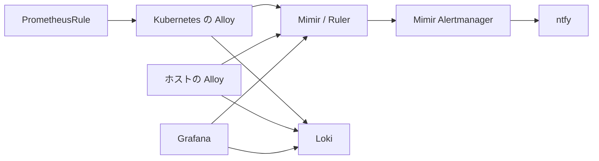

# 監視基盤の運用

両クラスタとホストのメトリクス・ログを、natsume の Mimir / Loki に集約する。
アラートは Mimir Ruler が評価し、同じ Mimir の Alertmanager から ntfy へ送る。
本番では合成通知や障害注入を行わず、設定・収集・評価・ラベルを確認する。

## 構成と設定の場所



| 対象 | 設定 |
|---|---|
| Kubernetes の収集・ルール同期 | [natsume Alloy](flux/clusters/natsume/apps/alloy/alloy-config.yaml)、[meruto Alloy](flux/clusters/meruto/apps/alloy/alloy-config.yaml) |
| ホストの収集 | [install-alloy role](ansible/roles/install-alloy/)、[host_vars](ansible/inventories/host_vars/) |
| Mimir / Ruler / Alertmanager | [Mimir HelmRelease](flux/clusters/natsume/apps/mimir/helmrelease-mimir.yaml) |
| 共通アラート | [monitoring-rules chart](charts/monitoring-rules/README.md)、各クラスタの `apps/monitoring-rules/` |
| アプリ固有のアラート・収集 | 各アプリの PrometheusRule / ServiceMonitor / PodMonitor / Probe |
| 通知経路と抑制 | natsume Alloy の `mimir.alerts.kubernetes.global_config` |
| ntfy の表示・認証・ACL | [ntfy HelmRelease](flux/clusters/natsume/apps/ntfy/helmrelease-ntfy.yaml) |

ホストと meruto は mTLS で `https://mimir.pstr.space/api/v1/push` と `https://loki.pstr.space/loki/api/v1/push` に送信する。
meruto の Vector も syslog を Loki に送る。
Mimir は単一 tenant `anonymous` を使い、Ruler の通知先は `http://mimir.mimir:8080/alertmanager`。
通知先は ntfy のみで、外部 heartbeat 監視はない。natsume / Mimir 全断時の通知はこの構成ではできない。

## ラベルとルールの管理

| ラベル | 意味 |
|---|---|
| `cluster` | Kubernetes は `natsume` / `meruto`。ホストは inventory の `cluster` に従う |
| `cnpg_cluster` | CNPG の DB 名。例: `misskey-cluster` |
| `hostname` | ホストの Alloy が収集するノード名 |
| `job` | 収集対象。Alloy 自己監視は Kubernetes が `alloy`、ホストが `alloy-host` |

Kubernetes Alloy は全メトリクスを共通 relabel に通す。
CNPG の元の DB ラベルを `cnpg_cluster` に保持したうえで、`cluster` を収集元で上書きする。
DB PodMonitor も Pod の `cnpg.io/cluster` から `cnpg_cluster` を付ける。
DB 単位の検索・集計・join に `cluster` を流用しない。

各 Alloy は自クラスタの PrometheusRule を同期する。
Mimir の保存先は `natsume/<namespace>/<resource>/<uid>` または `meruto/<namespace>/<resource>/<uid>`。
`extra_query_matchers` が入力を自クラスタに限定し、`external_labels` が評価結果にも同じ `cluster` を付ける。
複数クラスタを横断する式はこの同期対象に入れない。
meruto が停止しても、同期済みルールは natsume の Ruler で評価され続ける。

共通ルールの閾値・待機時間・調査手順は [chart README](charts/monitoring-rules/README.md) を参照する。
クラスタ別の hosts / units は Ansible inventory、databases は CNPG manifest と一致させる。
meruto の CNPG DB グループは無効にする。

## ntfy の通知と認証

通知先は `https://ntfy.pstr.space`。
購読には ntfy の認証済みユーザーを使い、Alertmanager 用ユーザーは送信専用にする。

| 条件 | topic | priority | tags | 再通知 |
|---|---|---|---|---|
| natsume / meruto、critical | `<cluster>-alerts` | 5 | `rotating_light` | 1時間 |
| natsume / meruto、warning | `<cluster>-alerts` | 3 | `warning` | 12時間 |
| natsume / meruto、その他・severity 欠落 | `<cluster>-alerts` | 2 | `information_source` | 12時間 |
| cluster 不明・欠落 | `pke-alerts` | severity に従う | severity に従う | severity に従う |
| resolved | 発火時と同じ | 2 | 発火時と同じ | `send_resolved=true` |

grouping は `cluster / alertname / namespace / severity`、初回待機は30秒、同一グループの更新間隔は5分。
タイトルは `Firing: <cluster> / <alertname>` または `Resolved: <cluster> / <alertname>` とする。
アイコンは tags に統一し、タイトルに絵文字を加えない。
priority と本文は ntfy のカスタム `alertmanager` template で設定する。

抑制は、同じ対象の critical → warning（PVC・ホスト filesystem・Longhorn node / disk・証明書期限）と、`http-get` の EndpointDown → HTTPStatusCodeError に限定する。
対象を識別するラベルは双方に必要で、欠落同士を一致させない。
ホスト停止や欠測だけを理由に、Pod・PVC の通知をまとめて抑制しない。

### 認証情報を設定・更新する

1Password の Kubernetes vault に次の item / field を置く。

| Item / field | 内容と同期先 |
|---|---|
| `ntfy-admin.auth-users` | `user:password-hash:role` のカンマ区切り。`ntfy/ntfy-admin` へ同期 |
| `ntfy-admin.auth-tokens` | `user:token` のカンマ区切り。同じ Secret へ同期 |
| `ntfy-alertmanager.token` | publish token 単体。`alloy/ntfy-alertmanager` へ同期 |

既存 admin と他のユーザー・token を保持する。
`alertmanager` は role `user` とし、`natsume-alerts`、`meruto-alerts`、`pke-alerts` の write-only ACL を与える。
anonymous は deny-all。Alloy には admin の認証情報を渡さない。
パスワード hash と token は ntfy CLI で生成し、値は直接 1Password に保存する。

通常の token rotation は次の順序で行う。

1. `ntfy-admin.auth-tokens` に新 token を追加し、旧 token と併存させる。
2. Secret の更新と ntfy Deployment の再起動を確認する。自動再起動が起きなければ rollout restart する。
3. `ntfy-alertmanager.token` を新 token に置き換える。
4. Alloy の Secret 再取得、Mimir への設定保存と有効設定の更新を確認する。
5. 設定反映と認証エラーの有無を確認してから、旧 token だけを外す。漏洩時は失効を優先する。

Alloy は Secret を1分ごとに取得し、再起動なしで再評価する。
Mimir Alertmanager が保存済み設定を取り込む間隔は5分なので、保存成功と有効設定への反映には時間差がある。
通常の取得待ちを同期失敗と判断して Alloy を再起動しない。
ntfy は単一 Pod / Recreate のため、再起動中は配信先が一時停止する。

## 変更を検証して反映する

リポジトリのルートで実行する。
Python 3、PyYAML、Jinja2、Helm、Docker、kubectl が必要。

```sh
python3 scripts/validate-monitoring-rules.py
python3 scripts/validate-ntfy-alerts.py
python3 scripts/validate-cluster-labels.py
```

ルールは render・inventory 照合・実 Alloy による式の変換・promtool の時系列テストで検証する。
通知はローカルの Alertmanager / ntfy で経路、抑制、firing / resolved、priority、tags、ACL、token rotation を検証する。
ラベル検証は両クラスタとホストの設定を描画し、ローカル送信で値を照合する。
本番 Secret や本番へのテスト通知は使わない。

### Kubernetes の設定

マージ後は Flux の通常同期を使い、変更した Kustomization / HelmRelease の Ready、適用 revision、generation を確認する。

```sh
kubectl --context natsume@soli -n flux-system get kustomizations
kubectl --context meruto@soli -n flux-system get kustomizations
kubectl --context natsume@soli -n monitoring-rules get helmrelease,prometheusrule
kubectl --context meruto@soli -n monitoring-rules get helmrelease,prometheusrule
kubectl --context natsume@soli -n ntfy rollout status deployment/ntfy --timeout=5m
```

Mimir に port-forward し、保存ルールと評価状態を確認する。

```sh
kubectl --context natsume@soli -n mimir port-forward svc/mimir 18080:8080
```

別ターミナルで評価状態を取得する。

```sh
curl -fsS -H 'X-Scope-OrgID: anonymous' \
  http://127.0.0.1:18080/prometheus/api/v1/rules |
  jq '[.data.groups[] | {file, name, rules: [.rules[] |
    {name, health, lastError, lastEvaluation, state, labels}]}]'
```

| API | 確認すること |
|---|---|
| `/prometheus/config/v1/rules` | 保存先 prefix、入力の cluster matcher、出力の cluster label |
| `/prometheus/api/v1/rules` | `health=ok`、空の lastError、更新される lastEvaluation |
| `/prometheus/api/v1/query` | 実メトリクス、対象ラベル、欠測と `up=0` の区別 |
| `/alertmanager/api/v2/alerts` | 発火中アラート、receiver、抑制状態 |
| `/alertmanager/api/v2/status` | 現在有効な通知経路と設定 |

Alloy UI・ログ・Mimir の設定には認証情報が含まれ得るため、必要な項目だけ抽出し、設定全体を共有しない。
自然発生の警報があれば入力と評価結果を照合する。通知を発生させる追加テストは不要。

### ホスト Alloy の設定

対象 unit は `host_vars/<host>.yaml` の `alloy_systemd_units` に宣言する。
存在しない unit や欠測を「正常な inactive」と扱わない。

```sh
cd ansible
ansible-playbook -i inventories/hosts.yaml update-alloy-monitoring.yaml --syntax-check
ansible-playbook -i inventories/hosts.yaml update-alloy-monitoring.yaml --limit natsume-08 --check --diff
ansible-playbook -i inventories/hosts.yaml update-alloy-monitoring.yaml --limit natsume-08 --diff
```

1台ずつ反映し、収集を確認して次へ進む。
専用 playbook は `/etc/alloy/prometheus.alloy` を導入済み binary で validate し、backup を保存して、変更時だけ Alloy を再起動する。
出力された backup path を控える。check mode だけでは適用時の validate 完了を確認できない。

Mimir で5分以上の更新を確認する。
`node_scrape_collector_success{collector="systemd"}=1`、期待する unit の `node_systemd_unit_state{state="active"}=1`、`up{job="alloy-host"}=1` と cluster / hostname を照合する。
node・Falco・対象ホストの etcd の収集も維持されていることを確認する。

## 障害を切り分ける

| 症状 | 確認する順序 |
|---|---|
| TargetDown | Alloy の target URL / last_error → endpoint → Service / Pod → NetworkPolicy |
| メトリクス欠測 | discovery と期待対象 → Alloy の状態 → remote_write → Mimir。`up=0` だけで判定しない |
| 通知が届かない | Ruler の発火状態 → Alertmanager の route / inhibition → 配送エラー → ntfy の認証 / ACL / Pod |
| Flux の警報 | 実リソースの Ready / suspend → sourceRef / dependsOn → controller ログ |
| DB / バックアップの警報 | [CNPG の調査手順](CNPG.md#アラートからの調査) |

Alloy の target を詳しく見る場合は、そのクラスタに port-forward する。

```sh
kubectl --context natsume@soli -n alloy port-forward deployment/alloy 18345:12345
```

`http://127.0.0.1:18345` の UI で対象 component の URL・health・last_error を確認する。
API scrape は HTTPS・ServiceAccount token・CA 検証が必要。
NetworkPolicy では、Longhorn manager の9500/TCP、Grafana renderer の8081/TCP に Alloy から到達できることを確認する。
Flux controller / Operator は `apps/flux-monitoring/` の PodMonitor で収集する。
Operator の `flux_resource_info` は値1と ready / suspended ラベルで状態を表し、対象 namespace は `exported_namespace`。状態更新は scrape より遅れるため、実リソースとも照合する。

remote_write は失敗・再試行 counter の増分、pending、最新送信時刻を合わせて確認する。
pending は WAL 全体の未送信量ではない。送信経路が止まると自己監視指標も欠測する。
Mimir の評価・通知エラーと Alertmanager の配送失敗も、counter の絶対値ではなく増分を見る。

監視範囲の制約は残る。
ホスト cAdvisor 単独の停止と Misskey の base backup 成功時刻は未カバー。
アプリ固有の式も実際の job 名・入力系列を確認し、評価エラーがないだけで監視できていると判断しない。

## 設定を戻す

Kubernetes の設定は Git で戻し、通常の Flux 同期で反映する。
ルール単位・グループ単位の停止は chart の `enabled: false` を使う。
chart の内容を戻す場合も新しい chart version を付ける。

ルール削除や保存先 prefix の変更では、Mimir の保存済み namespace も確認する。
同期元が停止していると古いルールが残るため、必要な場合は一覧から対象を特定して回収し、別クラスタのルールを削除しない。
ホスト Alloy は控えた backup を validate して復元し、サービス再起動後に収集を再確認する。
