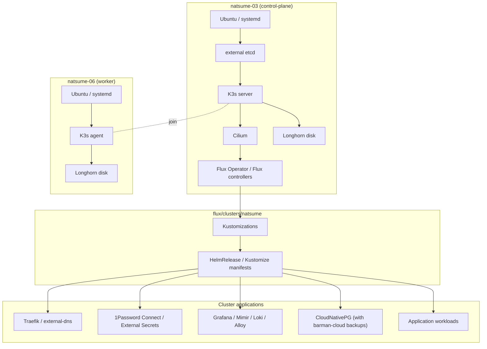
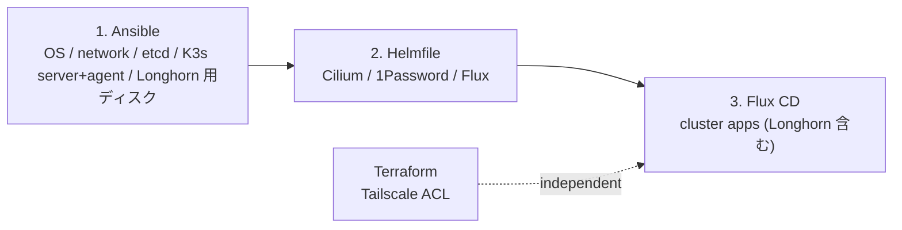

# Polestar Kubernetes Engine (PKE)

**Polestar Kubernetes Engine (PKE)** は、K3s クラスタと周辺アプリケーションをコードで構築・運用するためのリポジトリです。

現在の中心は `natsume-03` を control-plane (external etcd + K3s server)、`natsume-06` を worker (K3s agent) として分離した K3s クラスタです。クラスタ初期構築は Ansible、CNI と GitOps 基盤のブートストラップは Helmfile、クラスタアプリケーションの継続同期は Flux CD で管理します。永続ストレージは Longhorn を Flux 経由で導入し、各ノードの専用パーティションをバッキング先として利用します。

## アーキテクチャ概要


```mermaid
flowchart TB
    subgraph CP["natsume-03 (control-plane)"]
        OS_CP["Ubuntu / systemd"]
        ETCD["external etcd"]
        K3S_SERVER["K3s server"]
        CILIUM["Cilium"]
        LONGHORN_CP["Longhorn disk"]
        FLUX["Flux Operator / Flux controllers"]
    end

    subgraph WORKER["natsume-06 (worker)"]
        OS_W["Ubuntu / systemd"]
        K3S_AGENT["K3s agent"]
        LONGHORN_W["Longhorn disk"]
    end

    subgraph GitOps["flux/clusters/natsume"]
        BASE["Kustomizations"]
        APPS["HelmRelease / Kustomize manifests"]
    end

    subgraph Apps["Cluster applications"]
        TRAEFIK["Traefik / external-dns"]
        SECRETS["1Password Connect / External Secrets"]
        OBS["Grafana / Mimir / Loki / Alloy"]
        DB["CloudNativePG (with barman-cloud backups)"]
        SVC["Application workloads"]
    end

    OS_CP --> ETCD
    ETCD --> K3S_SERVER
    K3S_SERVER --> CILIUM
    K3S_SERVER --> LONGHORN_CP
    OS_W --> K3S_AGENT
    K3S_AGENT --> LONGHORN_W
    K3S_SERVER -. join .- K3S_AGENT
    CILIUM --> FLUX
    FLUX --> BASE
    BASE --> APPS
    APPS --> TRAEFIK
    APPS --> SECRETS
    APPS --> OBS
    APPS --> DB
    APPS --> SVC
```

## デプロイメントパイプライン


```mermaid
flowchart LR
    A["1. Ansible<br/>OS / network / etcd / K3s server+agent / Longhorn 用ディスク"] --> B["2. Helmfile<br/>Cilium / 1Password / Flux"]
    B --> C["3. Flux CD<br/>cluster apps (Longhorn 含む)"]
    D["Terraform<br/>Tailscale ACL"] -. independent .-> C
```

1. **Ansible**: `ansible/site-k3s.yaml` で OS 設定、ネットワーク、UFW、external etcd、K3s server / agent を構築します。Longhorn 用のディスクは `ansible/prepare-longhorn-storage.yaml` で個別に整備します。
2. **Helmfile**: `helmfile/helmfile.yaml` で Cilium、1Password Connect、Flux Operator を導入します。
3. **Flux CD**: `helmfile/manifests/flux/fluxinstance.yaml` が `flux/clusters/natsume` を同期し、クラスタアプリケーション (Longhorn、Traefik、観測基盤、各種ワークロード) を GitOps 管理します。
4. **Terraform**: `terraform/tailscale/` で Tailscale ACL を管理します。クラスタ構築パイプラインとは独立しています。

## リポジトリ構成

```
pke/
├── ansible/             # OS・ネットワーク・external etcd・K3s・Alloy・Longhorn ディスクの構成管理
├── helmfile/            # Cilium, 1Password Connect, Flux Operator のブートストラップ
├── flux/                # Flux CD で同期するクラスタアプリケーション定義
├── terraform/tailscale/ # Tailscale ACL 管理
├── .github/             # GitHub Actions
└── renovate.json5       # 依存関係自動更新設定
```

## 現行バージョン

| コンポーネント | バージョン |
|---------------|-----------|
| K3s | `v1.35.4+k3s1` |
| etcd | `3.6.10` |
| Cilium | `1.19.3` |
| 1Password Connect | `2.4.1` |
| Flux Operator | `0.48.0` |
| Flux distribution | `2.x` |
| Longhorn | `1.11.1` |
| external-dns | `1.21.1` |
| Tailscale Terraform provider | `0.28.0` |

## Ansible

### インベントリ

| パス | 内容 |
|------|------|
| `ansible/inventories/hosts.yaml` | ホストグループ定義 |
| `ansible/inventories/group_vars/all.yaml` | 共通変数 |
| `ansible/inventories/group_vars/etcd.yaml` | etcd 変数 |
| `ansible/inventories/group_vars/k3s_cluster.yaml` | K3s クラスタ共通変数 |
| `ansible/inventories/group_vars/k3s_server.yaml` | K3s server 変数 |
| `ansible/inventories/group_vars/k3s_agent.yaml` | K3s agent 変数 (server から node-token を自動取得) |
| `ansible/inventories/group_vars/longhorn_storage.yaml` | Longhorn 用ディスク変数 |
| `ansible/inventories/host_vars/natsume-0{3,6}.yaml` | 各ノードのネットワーク設定 |

現行の `hosts.yaml` は control-plane / worker を分離した 2 ノード構成です。`natsume-03` が `etcd` / `k3s_server` / `longhorn_storage`、`natsume-06` が `k3s_agent` / `longhorn_storage` に所属します。`k3s_agent` 用の `k3s_token` は server (`groups['k3s_server'][0]`) の `/var/lib/rancher/k3s/server/node-token` を `install-k3s` role が自動で読み出して join します。

### Playbook

| Playbook | 用途 |
|----------|------|
| `ansible/site-k3s.yaml` | ノード初期設定、ネットワーク、UFW、external etcd、K3s server / agent 構築 (一括) |
| `ansible/prepare-k3s-nodes.yaml` | OS / ネットワーク / sysctl / UFW のみを適用 |
| `ansible/install-k3s-servers.yaml` | 既存ノードに対して K3s server だけを展開 |
| `ansible/prepare-longhorn-storage.yaml` | Longhorn 用パーティションの作成・初期化 |
| `ansible/add-etcd-member.yaml` | 既存 etcd クラスタへの member 追加 (`-e etcd_member_host=<host>`) |
| `ansible/remove-etcd-member.yaml` | 既存 etcd クラスタからの member 削除 (`-e etcd_member_host=<host>`) |
| `ansible/configure-k3s-registry-mtls.yaml` | K3s containerd の private registry mTLS 設定 |
| `ansible/install-alloy.yaml` | Grafana Alloy 導入 |
| `ansible/upgrade-k3s.yaml` | K3s アップグレード |
| `ansible/upgrade-etcd.yaml` | etcd アップグレード |

`ansible/configure-k3s-registry-mtls.yaml` は新規クラスタ構築のデッドロックを避けるため、`site-k3s.yaml` には含めません。K3s、Flux、`registry.str08.net`、mTLS client 証明書の準備後に単独で実行します。

ノード追加・削除のオペレーションは `prepare-k3s-nodes.yaml` → (server を増やす場合は) `add-etcd-member.yaml` → `install-k3s-servers.yaml` または `site-k3s.yaml` の `Install k3s agents` パートを個別に流すことを想定しています。Longhorn を載せるノードでは `prepare-longhorn-storage.yaml` も必要です。

### Roles

| Role | 用途 |
|------|------|
| `general-configuration` | 基本 OS 設定 |
| `network` | Netplan 設定 |
| `sysctl` | カーネルパラメータ |
| `ufw` | Firewall 設定 |
| `setup-etcd` | external etcd の初期構築 |
| `etcd-maintenance` | etcd snapshot などの保守 |
| `etcd-precheck` | etcd ヘルスチェック |
| `etcd-member` | 稼働中 etcd クラスタへの member 追加 / 削除 |
| `install-k3s` | K3s server / agent 導入 (agent は server から node-token を自動取得) |
| `configure-k3s-registry-mtls` | K3s containerd の private registry mTLS 設定 |
| `longhorn-storage` | Longhorn 用ディスクのパーティション作成・XFS/ext4 初期化・マウント |
| `install-alloy` | Grafana Alloy 導入 |
| `upgrade-k3s` | K3s アップグレード |
| `upgrade-etcd` | etcd アップグレード |

## Helmfile Bootstrap

`helmfile/helmfile.yaml` は K3s 構築後に必要な基盤コンポーネントを導入します。

| Release | Namespace | Version | 用途 |
|---------|-----------|---------|------|
| `cilium` | `kube-system` | `1.19.3` | CNI |
| `connect` | `1password` | `2.4.1` | 1Password Connect |
| `flux-operator` | `flux-system` | `0.48.0` | Flux Operator |

Flux Operator の postsync hook は `helmfile/manifests/flux/fluxinstance.yaml` を適用します。`FluxInstance` は `https://github.com/Soli0222/pke.git` の `main` ブランチから `flux/clusters/natsume` を 1 分間隔で同期します。

## Flux CD

Flux のクラスタ定義は `flux/clusters/natsume/` にあります。

| パス | 内容 |
|------|------|
| `flux/clusters/natsume/kustomization.yaml` | Flux Kustomization 一覧のルート |
| `flux/clusters/natsume/kustomizations/*.yaml` | アプリごとの Flux `Kustomization` |
| `flux/clusters/natsume/apps/<app>/` | アプリごとの Namespace、HelmRepository、HelmRelease、追加 manifest |

各 Flux `Kustomization` は基本的に `interval: 10m`, `prune: true`, `wait: true` で管理し、依存関係は `dependsOn` で表現します。

### 管理コンポーネント

| 分類 | コンポーネント |
|------|---------------|
| 基盤 / CRD | `cnpg`, `cnpg-backup-config`, `cert-manager`, `cert-manager-config`, `external-secrets`, `prometheus-operator-crd` |
| ストレージ | `longhorn` |
| ネットワーク | `traefik`, `external-dns`, `external-dns-config` |
| 監視 | `grafana`, `mimir`, `loki`, `alloy`, `kube-state-metrics`, `prometheus-blackbox-exporter`, `blackbox-exporter-probes`, `uptime-kuma` |
| アプリ | `daypassed-bot`, `emoji-service`, `mc-mirror-cronjob`, `mk-stream`, `navidrome`, `note-tweet-connector`, `registry`, `rss-fetcher`, `spotify-nowplaying`, `spotify-reblend`, `sui`, `summaly` |
| 運用 | `renovate-operator` |

`external-dns-config` はクラスタ全体・各ノードの DNS レコード (`natsume(-0X).str08.net` / `pstr.space` / `tailscale.str08.net`) を `DNSEndpoint` で宣言します。`cnpg-backup-config` は CNPG の barman-cloud バックアップで共通利用する R2 認証情報 (`OnePasswordItem` 経由) を集約します。

### CloudNativePG クラスタ

Postgres を必要とするアプリは CNPG `Cluster` を `apps/<app>/cluster.yaml` に同梱しています。現行の `grafana` / `spotify-nowplaying` / `spotify-reblend` / `sui` クラスタは `instances: 2` で動作し、`grafana` クラスタは `barman-cloud.cloudnative-pg.io` plugin で R2 互換ストレージへ日次バックアップ (`apps/grafana/scheduledbackup.yaml` + `apps/grafana/objectstore.yaml`) を取得します。

## ネットワーク

| 項目 | 値 |
|------|----|
| 現行ノード | `natsume-03` (control-plane), `natsume-06` (worker) |
| Public IPv4 | `133.18.141.63/23` (03), `133.18.141.179/23` (06) |
| Public IPv6 | `2406:8c00:0:3464:133:18:141:63/64` (03), `2406:8c00:0:3464:133:18:141:179/64` (06) |
| Private IPv4 | `192.168.9.3/24` (03), `192.168.9.6/24` (06) |
| Private IPv6 | `fd00:192:168:9::3/64` (03), `fd00:192:168:9::6/64` (06) |
| Pod CIDR | `10.1.0.0/16`, `fd00:10:1::/64` |
| Service CIDR | `10.2.0.0/16`, `fd00:10:2::/64` |
| Cluster DNS | `10.2.0.10`, `fd00:10:2::a` |

K3s built-in の `traefik` と `helm-controller` は無効化しています。Ingress と Helm release は Flux 側で管理します。各ノードのレコードは `flux/clusters/natsume/apps/external-dns-config/node-dnsendpoints.yaml` で定義し、external-dns が DNS プロバイダへ反映します。

## ストレージ

- ストレージドライバは Longhorn (`flux/clusters/natsume/apps/longhorn`)。HelmRelease で `longhorn` chart `1.11.1` を導入します。
- 各ノード (`natsume-03` / `natsume-06`) では `ansible/prepare-longhorn-storage.yaml` (`longhorn-storage` role) が `/dev/vda` の 4 番パーティションを切り出してフォーマット・マウントし、Longhorn の disk として使えるよう整備します。

## Terraform

`terraform/tailscale/` は Tailscale ACL を管理します。

- Provider: `tailscale/tailscale` `0.28.0`
- State backend: Cloudflare R2 の S3 互換 backend
- 認証情報: `TAILSCALE_API_KEY` などの環境変数で注入
- 補助スクリプト: `setup.sh`, `import_acl.sh`

## CI/CD と Renovate

- Renovate は Terraform、Helmfile、Helm values、Ansible、GitHub Actions、custom regex を対象に依存関係を更新します。
- `renovate.json5` には K3s と etcd の Ansible 変数を追跡する custom manager があります。
- GitHub Actions:
  - `.github/workflows/lint-gha-workflows.yaml`: actionlint による workflow lint
  - `.github/workflows/flux-diff.yaml`: PR 上で `flux-local` による HelmRelease / Kustomization の diff コメント

## 運用メモ

- シークレットは 1Password / External Secrets / `OnePasswordItem` の既存パターンに合わせ、平文 Secret をコミットしないでください。
- K3s と etcd のアップグレードは `ansible/upgrade-k3s.yaml` と `ansible/upgrade-etcd.yaml` を使います。
- ノード追加 / 削除は etcd → K3s server / agent → Longhorn ディスクの順で playbook を分けて流し、`hosts.yaml` と `host_vars/<node>.yaml` の追記、`flux/clusters/natsume/apps/external-dns-config/node-dnsendpoints.yaml` のレコード更新を忘れないでください。
- 新しい Flux アプリを追加する場合は `apps/<app>/`、`kustomizations/<app>.yaml`、ルート `kustomization.yaml` の 3 箇所をそろえてください。Postgres を使うアプリでは CNPG `Cluster` と必要に応じて barman-cloud `ObjectStore` / `ScheduledBackup` を同じディレクトリに同梱します。
- Terraform state は Cloudflare R2 backend に保存されます。
