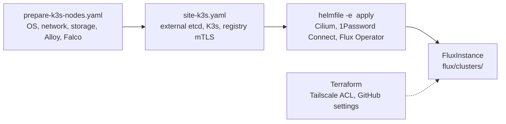

# Polestar Kubernetes Engine

**Polestar Kubernetes Engine (PKE)** は、オンプレミスと外部 VPS 上の K3s クラスタを Ansible、Helmfile、Flux CD、Terraform で管理するためのリポジトリです。
複数の独立したクラスタを `cluster:` host variable で識別し、Ansible の inventory、Helmfile environment、Flux の同期パスをクラスタごとに切り替えます。

## 管理対象クラスタ

| クラスタ | ノード | 役割 | 補足 |
|----------|--------|------|------|
| `natsume` | `natsume-03`, `natsume-08` | 本番ワークロード、監視基盤、DB | `natsume-03` が external etcd と K3s server を持つ。実態として `natsume-03` に Longhorn 600GB と TopoLVM 200GB があるが、inventory 上の storage role は `natsume-08` だけに付けている |
| `meruto` | `meruto-01` | 単一ノードクラスタ | private interface のみを使い、Longhorn は既存 `ubuntu-vg` の空き領域を使う |

すべての host_vars には `cluster: <name>` を置きます。
`setup-etcd`、`install-k3s`、Alloy、Flux はこの値からクラスタ固有の接続先やラベルを組み立てます。

## デプロイの流れ


```mermaid
flowchart LR
    A["prepare-k3s-nodes.yaml<br/>OS, network, storage, Alloy, Falco"] --> B["site-k3s.yaml<br/>external etcd, K3s, registry mTLS"]
    B --> C["helmfile -e <cluster> apply<br/>Cilium, 1Password Connect, Flux Operator"]
    C --> D["FluxInstance<br/>flux/clusters/<cluster>"]
    E["Terraform<br/>Tailscale ACL, GitHub settings"] -.-> D
```

`ansible/prepare-k3s-nodes.yaml` はノードの前提条件を整えます。
この playbook は OS 設定、SSH sudo 用 authorized_keys、Netplan、sysctl、UFW、TopoLVM、Longhorn backing volume、Alloy、Falco を扱います。

`ansible/site-k3s.yaml` は external etcd、etcd maintenance、K3s server、K3s agent、K3s containerd の private registry mTLS を構成します。
registry mTLS は現在 `site-k3s.yaml` に含まれます。

Helmfile は `helmfile -e natsume apply` または `helmfile -e meruto apply` で実行します。
`helmDefaults.kubeContext` は environment の `kubeContext` を使うため、`-e <cluster>` が kubeconfig context の切り替え点になります。

Flux Operator は `helmfile/manifests/flux/<cluster>/fluxinstance.yaml` の `FluxInstance` から `flux/clusters/<cluster>` を同期します。

Terraform は Kubernetes 構築とは独立しています。
`terraform/tailscale/` は Tailscale ACL を管理し、`terraform/github/` は GitHub リポジトリ設定と GitHub Actions secrets を管理します。

## リポジトリ構成

```
pke/
├── ansible/                 # OS, network, external etcd, K3s, storage, Alloy, Falco
├── helmfile/                # Cilium, 1Password Connect, Flux Operator の bootstrap
│   ├── helmfile.yaml.gotmpl
│   ├── environments/<cluster>.yaml
│   ├── manifests/flux/<cluster>/fluxinstance.yaml
│   └── values/*.gotmpl
├── flux/clusters/<cluster>/ # Flux CD が同期するクラスタ別アプリ定義
├── terraform/github/        # GitHub repository settings と Actions secrets
├── terraform/tailscale/     # Tailscale ACL
├── .github/workflows/       # Renovate と flux-local diff
└── renovate.json5           # Renovate 設定
```

## 現行バージョン

| 対象 | バージョン |
|------|------------|
| K3s | `v1.36.1+k3s1` |
| etcd | `3.6.12` |
| Cilium | `1.19.5` |
| 1Password Connect | `2.4.1` |
| Flux Operator | `0.52.0` |
| Flux distribution | `2.x` |
| CloudNativePG chart | `0.28.3` |
| CNPG barman cloud plugin | `0.7.0` |
| Longhorn | `1.12.0` |
| TopoLVM | `16.1.1` |
| Tetragon | `1.7.0` |
| cert-manager | `v1.20.2` |
| Traefik | `41.0.0` |
| external-dns | `1.21.1` |
| kube-state-metrics | `7.5.1` |
| Alloy | `1.10.0` |
| cloudflare-tunnel-ingress-controller | `0.0.23` |
| cloudflared | `2026.3.0` |
| Tailscale Terraform provider | `0.29.2` |
| GitHub Terraform provider | `6.12.1` |
| Terraform external provider | `2.4.0` |

## Ansible

### Inventory

| パス | 内容 |
|------|------|
| `ansible/inventories/hosts.yaml` | 全ホストと全グループを `all.children` 配下に定義する |
| `ansible/inventories/group_vars/all.yaml` | 共通変数、Falco の既定有効化、Python interpreter |
| `ansible/inventories/group_vars/etcd.yaml` | etcd version、PKI path、snapshot maintenance |
| `ansible/inventories/group_vars/k3s_cluster.yaml` | K3s version、dual-stack CIDR、無効化する built-in component |
| `ansible/inventories/group_vars/k3s_server.yaml` | external etcd datastore endpoint と TLS client 設定 |
| `ansible/inventories/group_vars/k3s_agent.yaml` | K3s agent の server URL |
| `ansible/inventories/group_vars/topolvm_storage.yaml` | TopoLVM 用 partition と VG |
| `ansible/inventories/group_vars/longhorn_storage.yaml` | Longhorn 用 partition、LV、mount path |
| `ansible/inventories/host_vars/<host>.yaml` | `cluster:`、network、TLS SAN、storage mode など |

`hosts.yaml` では `natsume_etcd` と `meruto_etcd` を定義し、親グループ `etcd` に束ねます。
`setup-etcd` と `k3s_datastore_endpoint` は `groups[cluster + '_etcd']` を参照するため、クラスタ追加時は `<cluster>_etcd` と host_vars の `cluster:` をそろえます。

### Host Groups

| グループ | 現在のホスト | 用途 |
|----------|--------------|------|
| `natsume_etcd` | `natsume-03` | natsume の external etcd |
| `meruto_etcd` | `meruto-01` | meruto の external etcd |
| `etcd` | `natsume_etcd`, `meruto_etcd` | etcd role の親グループ |
| `k3s_server` | `natsume-03`, `meruto-01` | K3s server |
| `k3s_agent` | `natsume-08` | K3s agent |
| `topolvm_storage` | `natsume-08` | TopoLVM 用 VG を作るノード |
| `longhorn_storage` | `natsume-08`, `meruto-01` | Longhorn backing volume を作るノード |

### Playbooks

| Playbook | 用途 |
|----------|------|
| `ansible/prepare-k3s-nodes.yaml` | OS 設定、SSH sudo、network、sysctl、UFW、TopoLVM、Longhorn、Alloy、Falco |
| `ansible/site-k3s.yaml` | external etcd、etcd maintenance、etcd precheck、K3s server、K3s agent、registry mTLS |
| `ansible/add-etcd-member.yaml` | 稼働中 etcd への member 追加 |
| `ansible/remove-etcd-member.yaml` | 稼働中 etcd からの member 削除 |
| `ansible/upgrade-k3s.yaml` | K3s server と agent の rolling upgrade |
| `ansible/upgrade-etcd.yaml` | etcd precheck、rolling upgrade、postcheck |
| `ansible/install-docker.yaml` | Docker Engine の導入 |

etcd member を追加する場合は `-e etcd_member_host=<host>` を渡します。
member 削除は必要に応じて `-e etcd_member_leader_host=<leader>` で操作元を指定します。

### Storage

natsume では inventory 上の storage role は `natsume-08` だけに付けています。
ただし、実態として `natsume-03` にも Longhorn 600GB と TopoLVM 200GB があります。
これは現在の inventory では `longhorn_storage` と `topolvm_storage` の対象にしません。
`natsume-08` の `topolvm_storage` は `/dev/vda4` に 300GiB の partition を作り、VG `topolvm` を作成します。
`natsume-08` の `longhorn_storage` は `/dev/vda5` を使い、LV `data` を `/var/lib/longhorn` に ext4 で mount します。

meruto では `longhorn_storage_use_existing_vg: true` を使います。
この設定では partition、PV、VG の作成を省略し、既存 `ubuntu-vg` の空き領域に LV `data` を作ります。

Flux 側の Longhorn は両クラスタとも `defaultClassReplicaCount: 1`、`defaultDataLocality: best-effort`、`createDefaultDiskLabeledNodes: true` です。
Longhorn の default disk を作るノードには `node.longhorn.io/create-default-disk=true` label が必要です。

TopoLVM は natsume のみで有効です。
`misskey`、`grafana`、`sui`、`spotify-reblend`、`spotify-nowplaying` の CNPG `Cluster` は `storageClass: topolvm` を使います。

## Helmfile Bootstrap

`helmfile/helmfile.yaml.gotmpl` は K3s 構築後の bootstrap だけを担当します。

```bash
helmfile -e natsume apply
helmfile -e meruto apply
```

| Release | Namespace | Chart | Version |
|---------|-----------|-------|---------|
| `cilium` | `kube-system` | `cilium/cilium` | `1.19.5` |
| `connect` | `1password` | `1password/connect` | `2.4.1` |
| `flux-operator` | `flux-system` | `oci://ghcr.io/controlplaneio-fluxcd/charts/flux-operator` | `0.52.0` |

`helmfile/environments/<cluster>.yaml` には `cluster`、`kubeContext`、Cilium の Pod CIDR、1Password Connect の item 名を置きます。
現行の natsume と meruto はどちらも 1Password Connect の `PKE-natsume` item を参照します。

## Flux CD

Flux の root は `flux/clusters/<cluster>/kustomization.yaml` です。
各アプリは `flux/clusters/<cluster>/apps/<app>/` と `flux/clusters/<cluster>/kustomizations/<app>.yaml` の組で管理します。
多くの Flux `Kustomization` は `interval: 10m`、`prune: true`、`wait: true` で動き、適用順は `dependsOn` で表します。

### natsume

| 分類 | コンポーネント |
|------|----------------|
| 基盤と CRD | `cnpg`, `cnpg-backup-config`, `prometheus-operator-crd`, `cert-manager`, `cert-manager-config` |
| Storage | `longhorn`, `longhorn-config`, `topolvm` |
| Network と Security | `traefik`, `external-dns`, `external-dns-config`, `tetragon`, `tetragon-policies` |
| Observability | `kube-state-metrics`, `grafana`, `mimir`, `loki`, `alloy` |
| Apps | `misskey`, `note-tweet-connector`, `registry`, `spotify-nowplaying`, `spotify-reblend`, `sui`, `summaly` |

`external-dns-config` は `natsume.str08.net`、`natsume.pstr.space`、node record を `DNSEndpoint` として宣言します。
`cert-manager-config` は `letsencrypt-dns01`、`letsencrypt-http01`、Traefik mTLS 用の `pke-natsume-mtls` `TLSOption` を持ちます。
`cnpg-backup-config` は Flux の postBuild substitution 用 Secret `cnpg-backup-flux-vars` を 1Password から作ります。

### meruto

| 分類 | コンポーネント |
|------|----------------|
| 基盤と CRD | `cnpg`, `prometheus-operator-crd`, `cert-manager`, `cert-manager-config` |
| Storage | `longhorn`, `longhorn-config` |
| Network と Security | `traefik`, `external-dns`, `cloudflare-tunnel-ingress-controller`, `tetragon`, `tetragon-policies` |
| Observability | `alloy`, `kube-state-metrics`, `prometheus-blackbox-exporter`, `blackbox-exporter-probes`, `ix2215-snmp-exporter`, `vector` |
| Apps | `daypassed-bot`, `emoji-service`, `mc-mirror-cronjob`, `mk-stream`, `navidrome`, `rss-fetcher` |

meruto の `cert-manager-config` は `letsencrypt-dns01` と `cloudflare-api-token` だけを持ちます。
`external-dns` は `txtPrefix: meruto-` を使い、Traefik Ingress を対象にします。
`cloudflare-tunnel-ingress-controller` は 1Password の `cloudflared-pke-meruto` を使い、IngressClass `cloudflare-tunnel` を提供します。
`ix2215-snmp-exporter` は `192.168.10.1` の SNMP metrics を収集し、`vector` は syslog を Loki に送ります。

## CloudNativePG

CNPG `Cluster` を持つアプリは natsume 側だけです。
`misskey` は `barman-cloud.cloudnative-pg.io` plugin による WAL archive と base backup を使い、他のクラスタは `pg_dump` CronJob を使います。
詳細な運用手順は [CNPG.md](./CNPG.md) にあります。

| アプリ | Cluster | Node | Storage | Backup |
|--------|---------|------|---------|--------|
| `misskey` | `misskey-cluster` | `natsume-03` | `topolvm`, `150Gi` | WAL archive と base backup |
| `grafana` | `grafana-cluster` | `natsume-08` | `topolvm`, `10Gi` | `pg_dump` 03:00 JST |
| `sui` | `sui-cluster` | `natsume-08` | `topolvm`, `5Gi` | `pg_dump` 03:05 JST |
| `spotify-reblend` | `reblend-cluster` | `natsume-08` | `topolvm`, `5Gi` | `pg_dump` 03:10 JST |
| `spotify-nowplaying` | `spn-cluster` | `natsume-08` | `topolvm`, `5Gi` | `pg_dump` 03:15 JST |

`misskey` は `ghcr.io/soli0222/pgroonga-cnpg/4.0.6-alpine:18` を使います。
`pg_dump` CronJob は `postgres:18.4-alpine3.23` を使い、R2 互換 bucket `s3://cnpg-backup/` に 7 日保持で dump を置きます。

## Network

### natsume

| Node | Public IPv4 | Public IPv6 | Private IPv4 | Private IPv6 |
|------|-------------|-------------|--------------|--------------|
| `natsume-03` | `133.18.141.63/23` | `2406:8c00:0:3464:133:18:141:63/64` | `192.168.9.3/24` | `fd00:192:168:9::3/64` |
| `natsume-08` | `133.18.125.154/23` | `2406:8c00:0:3459:133:18:125:154/64` | `192.168.9.8/24` | `fd00:192:168:9::8/64` |

### meruto

| Node | Public | Private IPv4 | Private IPv6 |
|------|--------|--------------|--------------|
| `meruto-01` | なし | `192.168.10.3/24` | `fd00:192:168:10::3/64` |

### Common CIDR

| 項目 | 値 |
|------|----|
| Pod CIDR | `10.1.0.0/16`, `fd00:10:1::/64` |
| Service CIDR | `10.2.0.0/16`, `fd00:10:2::/64` |
| Cluster DNS | `10.2.0.10`, `fd00:10:2::a` |

K3s built-in の `traefik` と `helm-controller` は無効化します。
Ingress と Helm release は Flux 側で管理します。

## Terraform

`terraform/tailscale/` は Tailscale ACL を管理します。
provider は `tailscale/tailscale` `0.29.2` です。
state backend は Cloudflare R2 の S3 互換 backend です。
`setup.sh` は `TAILSCALE_API_KEY` と R2 backend credentials を 1Password から export します。

`terraform/github/` は `Soli0222/*` の repository settings、default branch、GitHub Actions secrets を管理します。
provider は `integrations/github` `6.12.1` と `hashicorp/external` `2.4.0` です。
詳細は [terraform/github/README.md](./terraform/github/README.md) にあります。

## CI と Renovate

`.github/workflows/renovate.yaml` は 3 時間ごとに self-hosted Renovate を実行します。
GitHub App token は `RENOVATE_CLIENT_ID` と `RENOVATE_PRIVATE_KEY` から生成します。

`.github/workflows/flux-diff.yaml` は pull request の `flux/**` 変更に対して `flux-local` diff を実行します。
現行 workflow は `flux/clusters/natsume` を対象にし、`helmrelease` と `kustomization` の diff を sticky comment に投稿します。

`renovate.json5` は Ansible、Flux、GitHub Actions、Helmfile、Helm values、Kubernetes manifest、Terraform、custom regex を対象にします。
custom regex は `etcd_version` と `k3s_version` を GitHub releases から追跡します。

## 運用メモ

Secret は 1Password Operator の `OnePasswordItem` を基本にします。
平文 Secret はコミットしません。

新しい Flux アプリを追加するときは `apps/<app>/`、`kustomizations/<app>.yaml`、root `kustomization.yaml` を同時に更新します。
HelmRelease の chart version は Renovate が追跡できる形で明示します。

ノードを追加または削除するときは `hosts.yaml` と `host_vars/<node>.yaml` を更新します。
natsume の public または private DNS を扱う場合は `flux/clusters/natsume/apps/external-dns-config/node-dnsendpoints.yaml` も確認します。

新規クラスタを追加するときは、`<cluster>_etcd` group、host_vars の `cluster:`、`helmfile/environments/<cluster>.yaml`、`helmfile/manifests/flux/<cluster>/fluxinstance.yaml`、`flux/clusters/<cluster>/` をそろえます。
