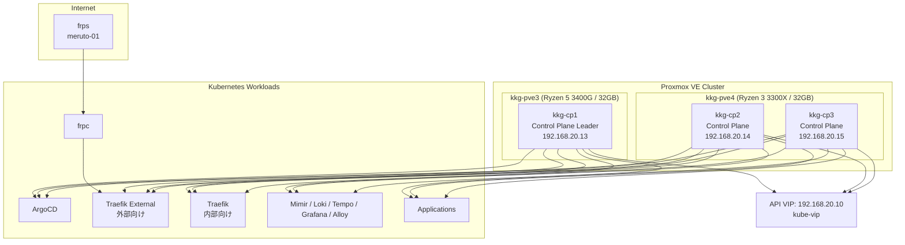
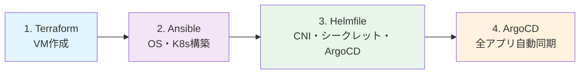
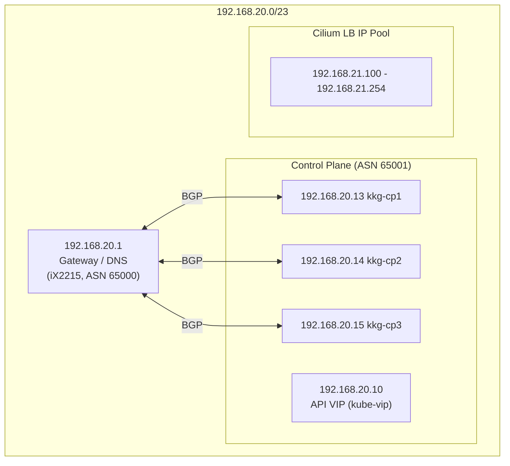

# Polestar Kubernetes Engine (PKE)

オンプレミスの Kubernetes プラットフォーム **Polestar Kubernetes Engine (PKE)** をコードで構築・運用するためのリポジトリです。

## アーキテクチャ概要


```mermaid
graph TB
    subgraph Internet
        FRPS[frps<br/>meruto-01]
    end

    subgraph "Proxmox VE Cluster"
        subgraph "kkg-pve3 (Ryzen 5 3400G / 32GB)"
            cp1[kkg-cp1<br/>Control Plane Leader<br/>192.168.20.13]
        end
        subgraph "kkg-pve4 (Ryzen 3 3300X / 32GB)"
            cp2[kkg-cp2<br/>Control Plane<br/>192.168.20.14]
            cp3[kkg-cp3<br/>Control Plane<br/>192.168.20.15]
        end
    end

    VIP[API VIP: 192.168.20.10<br/>kube-vip]

    cp1 & cp2 & cp3 --> VIP

    FRPS --> FRPC

    subgraph "Kubernetes Workloads"
        ArgoCD
        FRPC[frpc]
        TraefikExt[Traefik External<br/>外部向け]
        Traefik[Traefik<br/>内部向け]
        Monitoring[Mimir / Loki / Tempo / Grafana / Alloy]
        Apps[Applications]
    end

    FRPC --> TraefikExt
    cp1 & cp2 & cp3 --> ArgoCD & Traefik & TraefikExt & Monitoring & Apps
```

### kkgクラスタ（Proxmox VE × HA Kubernetes）

物理ノード 2 台の Proxmox VE クラスタ上に、HA 構成の Kubernetes クラスターを運用しています。

#### ハードウェア構成

| ホスト名  | CPU             | メモリ | ストレージ | IPアドレス    |
|-----------|-----------------|--------|-----------|---------------|
| kkg-pve3  | Ryzen 5 3400G   | 32GB   | 512GB SSD | 192.168.20.4  |
| kkg-pve4  | Ryzen 3 3300X   | 32GB   | 512GB SSD | 192.168.20.5  |

#### 仮想マシン構成

##### Kubernetesコントロールプレーン

| VM名     | CPU | メモリ | ディスク | IPアドレス     | ホストマシン |
|----------|-----|--------|----------|---------------|-------------|
| kkg-cp1  | 8   | 32GB   | 100GB    | 192.168.20.13 | kkg-pve3    |
| kkg-cp2  | 8   | 16GB   | 100GB    | 192.168.20.14 | kkg-pve4    |
| kkg-cp3  | 8   | 16GB   | 100GB    | 192.168.20.15 | kkg-pve4    |

API VIP（192.168.20.10）は kube-vip が各コントロールプレーンノード上の Static Pod としてリーダー選出・ARP で提供します。

## デプロイメントパイプライン


```mermaid
flowchart LR
    A["1. Terraform<br/>VM作成"] --> B["2. Ansible<br/>OS・K8s構築"]
    B --> C["3. Helmfile<br/>CNI・シークレット・ArgoCD"]
    C --> D["4. ArgoCD<br/>全アプリ自動同期"]

    style A fill:#e1f5fe
    style B fill:#f3e5f5
    style C fill:#e8f5e9
    style D fill:#fff3e0
```

1. **Terraform** — Proxmox 上に VM を作成（`terraform/kkg/`）
2. **Ansible** — OS 設定、containerd、Kubernetes、kube-vip、外部 etcd、監��エージェント、frps を自動化（`ansible/`）
3. **Helmfile** — Cilium、1Password Connect、ArgoCD のブートストラップ（`helmfile/`）
4. **ArgoCD** — App of Apps パターンで全コンポーネント・アプリケーションを GitOps 管理（`argocd/`）

## リポジトリ構成

```
pke/
├── terraform/          # インフラプロビジョニング
│   ├── kkg/            #   Proxmox VM管理
│   └── tailscale/      #   Tailscale ACL管理
├── ansible/            # 構成管理・自動化
├── helmfile/           # ブートストラップ（Cilium, 1Password, ArgoCD）
├── argocd/             # GitOps アプリケーション定義（39 アプリ）
├── scripts/            # CI/CDヘルパースクリプト
├── .github/            # GitHub Actions ワークフロー
└── renovate.json5      # 依存関係自動更新設定
```

## 現在のバージョン

| コンポーネント | バージョン |
|---------------|-----------|
| Kubernetes    | 1.35.3    |
| containerd    | 2.2.2     |
| runc          | 1.4.1     |
| CNI Plugins   | 1.9.1     |
| Cilium        | 1.19.2    |
| 1Password Connect | 2.4.1 |
| ArgoCD (Chart) | 9.4.17  |
| OS テンプレート | Ubuntu 24.04 |

## ArgoCD 管理コンポーネント

### 基盤・ネットワーク（Wave 0-2）

| コンポーネント | Chart Version | 用途 |
|---------------|---------------|------|
| Prometheus Operator CRDs | 24.0.1 | 監視CRD基盤 |
| CloudNative-PG | 0.27.1 | PostgreSQLオペレーター |
| Traefik CRDs | 1.16.0 | Ingress CRD |
| cert-manager | v1.20.1 | 証明書管理 |
| Falco | 8.0.1 | ランタイムセキュリティ |
| MinIO Operator | 7.1.1 | オブジェクトストレージ |
| NFS Subdir External Provisioner | 4.0.18 | 永続ストレージ |
| external-dns | 1.20.0 | DNS自動管理 |
| Metrics Server | 3.13.0 | リソースメトリクス |
| Traefik | 39.0.7 | Ingress Controller |
| Traefik External | 39.0.7 | 外部向けIngress Controller |
| frpc | - | FRP クライアント（カスタムマニフェスト） |
| kube-state-metrics | 7.2.2 | Kubernetesメトリクス |

### 監視・オブザーバビリティ（Wave 3-5）

| コンポーネント | Chart Version | 用途 |
|---------------|---------------|------|
| Grafana | 10.5.15 | ダッシュボード |
| Mimir Distributed | 6.0.6 | メトリクスストレージ |
| Loki | 6.55.0 | ログ集約 |
| Tempo Distributed | 1.61.3 | 分散トレーシング |
| Alloy | 1.6.2 | 監視エージェント |
| Vector | 0.51.0 | ログ・オブザーバビリティ |
| Uptime Kuma | 4.0.0 | アップタイム監視 |
| Prometheus Blackbox Exporter | 11.9.1 | 外形監視 |
| Blackbox Exporter Probes | 1.0.0 | 外形監視プローブ定義 |
| iX2215 SNMP Exporter | 9.13.1 | ネットワーク機器監視 |
| MinIO Tenant | 7.1.1 | オブジェクトストレージ実体 |

### アプリケーション（Wave 2-3）

| アプリケーション | Chart Version | 用途 |
|-----------------|---------------|------|
| navidrome | 2.1.3 | 音楽ストリーミングサーバー |
| komga | 1.0.4 | コミック・書籍サーバー |
| wallos | 0.1.7 | サブスクリプション管理 |
| daypassed-bot | 0.1.0 | 日付関連Bot |
| mc-mirror-cronjob | 0.2.1 | MinecraftミラーCronJob |
| mk-stream | 1.0.0 | ストリーミングサービス |
| note-tweet-connector | 1.0.3 | Note投稿連携 |
| spotify-nowplaying | 3.0.3 | Spotify再生状況表示 |
| spotify-reblend | 0.1.4 | Spotifyリブレンド |
| summaly | 0.1.6 | URLプレビュー |
| emoji-service | 0.1.1 | 絵文字サービス |
| rss-fetcher | 0.1.3 | RSSフェッチャー |
| registry | 0.1.1 | コンテナレジストリ |
| sui | 0.1.2 | スタートページ |
| renovate-operator | 4.0.0 | 依存関係自動更新オペレーター |

### 外部サーバー（Ansible管理）

| サーバー | 用途 |
|---------|------|
| meruto-01 | frps リバースプロキシ + Grafana Alloy |
| natsume-01 | Misskey ホスティング（mi.soli0222.com） |

## ネットワーク構成


```mermaid
graph TB
    subgraph "192.168.20.0/23"
        GW["192.168.20.1<br/>Gateway / DNS<br/>(iX2215, ASN 65000)"]

        subgraph "Control Plane (ASN 65001)"
            VIP["192.168.20.10<br/>API VIP (kube-vip)"]
            CP1["192.168.20.13 kkg-cp1"]
            CP2["192.168.20.14 kkg-cp2"]
            CP3["192.168.20.15 kkg-cp3"]
        end

        subgraph "Cilium LB IP Pool"
            LBPool["192.168.21.100 - 192.168.21.254"]
        end
    end

    GW <-->|BGP| CP1 & CP2 & CP3
```

- **API VIP**: 192.168.20.10（kube-vip、リーダー選出 + ARP）
- **Pod Network CIDR**: 10.26.0.0/16
- **Cilium LB IP Pool**: 192.168.21.100 - 192.168.21.254
- **BGP**: Cilium BGP Control Plane — 全ノード（ASN 65001）が iX2215（ASN 65000）と直接ピアリングし、LoadBalancer IP を広報
- **外部公開**: Internet → frps（meruto-01） → frpc → traefik-external → ワークロード

## CI/CD

- **Renovate**: Helm chart、Ansible バージョン、GitHub Actions、Terraform の依存関係を自動更新
- **GitHub Actions**:
  - `helm-template-diff.yaml` — PR で ArgoCD アプリの Helm テンプレート差分を自動レビュー
  - `lint-gha-workflows.yaml` — GitHub Actions ワークフローの Lint

## 注意事項

- シークレット（Cloudflare/1Password など）は 1Password Vault に保管し、`helmfile/` の手順に従って参照してください
- バージョンアップは Ansible の `upgrade-*.yaml` を使用できます（Kubernetes / containerd）
- Terraform 状態ファイルは Cloudflare R2 に保存されます

## 参照

- [terraform/kkg/README.md](terraform/kkg/README.md) — Proxmox VM 管理
- [terraform/tailscale/README.md](terraform/tailscale/README.md) — Tailscale ACL 管理
- [ansible/README.md](ansible/README.md) — 構成管理・自動化
- [helmfile/README.md](helmfile/README.md) — ブートストラップ
