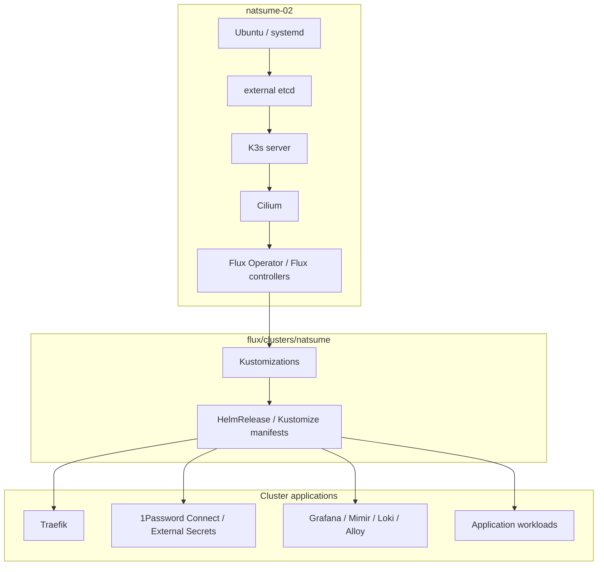
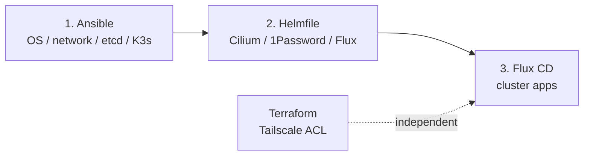

# Polestar Kubernetes Engine (PKE)

**Polestar Kubernetes Engine (PKE)** は、K3s クラスタと周辺アプリケーションをコードで構築・運用するためのリポジトリです。

現在の中心は `natsume-02` 上の K3s + external etcd 構成です。クラスタ初期構築は Ansible、CNI と GitOps 基盤のブートストラップは Helmfile、クラスタアプリケーションの継続同期は Flux CD で管理します。

## アーキテクチャ概要


```mermaid
flowchart TB
    subgraph Host["natsume-02"]
        OS["Ubuntu / systemd"]
        ETCD["external etcd"]
        K3S["K3s server"]
        CILIUM["Cilium"]
        FLUX["Flux Operator / Flux controllers"]
    end

    subgraph GitOps["flux/clusters/natsume"]
        BASE["Kustomizations"]
        APPS["HelmRelease / Kustomize manifests"]
    end

    subgraph Apps["Cluster applications"]
        TRAEFIK["Traefik"]
        SECRETS["1Password Connect / External Secrets"]
        OBS["Grafana / Mimir / Loki / Alloy"]
        SVC["Application workloads"]
    end

    OS --> ETCD
    ETCD --> K3S
    K3S --> CILIUM
    CILIUM --> FLUX
    FLUX --> BASE
    BASE --> APPS
    APPS --> TRAEFIK
    APPS --> SECRETS
    APPS --> OBS
    APPS --> SVC
```

## デプロイメントパイプライン


```mermaid
flowchart LR
    A["1. Ansible<br/>OS / network / etcd / K3s"] --> B["2. Helmfile<br/>Cilium / 1Password / Flux"]
    B --> C["3. Flux CD<br/>cluster apps"]
    D["Terraform<br/>Tailscale ACL"] -. independent .-> C
```

1. **Ansible**: `ansible/site-k3s.yaml` で OS 設定、ネットワーク、UFW、external etcd、K3s server / agent を構築します。
2. **Helmfile**: `helmfile/helmfile.yaml` で Cilium、1Password Connect、Flux Operator を導入します。
3. **Flux CD**: `helmfile/manifests/flux/fluxinstance.yaml` が `flux/clusters/natsume` を同期し、クラスタアプリケーションを GitOps 管理します。
4. **Terraform**: `terraform/tailscale/` で Tailscale ACL を管理します。クラスタ構築パイプラインとは独立しています。

## リポジトリ構成

```
pke/
├── ansible/             # OS・ネットワーク・external etcd・K3s・Alloy の構成管理
├── helmfile/            # Cilium, 1Password Connect, Flux Operator のブートストラップ
├── flux/                # Flux CD で同期するクラスタアプリケーション定義
├── terraform/tailscale/ # Tailscale ACL 管理
├── .github/             # GitHub Actions
└── renovate.json5       # 依存関係自動更新設定
```

## 現行バージョン

| コンポーネント | バージョン |
|---------------|-----------|
| K3s | `v1.35.3+k3s1` |
| etcd | `3.6.10` |
| Cilium | `1.19.3` |
| 1Password Connect | `2.4.1` |
| Flux Operator | `0.48.0` |
| Flux distribution | `2.x` |
| Tailscale Terraform provider | `0.28.0` |

## Ansible

### インベントリ

| パス | 内容 |
|------|------|
| `ansible/inventories/hosts.yaml` | ホストグループ定義 |
| `ansible/inventories/group_vars/all.yaml` | 共通変数 |
| `ansible/inventories/group_vars/etcd.yaml` | etcd 変数 |
| `ansible/inventories/group_vars/k3s_cluster.yaml` | K3s クラスタ共通変数 |
| `ansible/inventories/group_vars/k3s_server.yaml` | K3s server 変数 |
| `ansible/inventories/group_vars/k3s_agent.yaml` | K3s agent 変数 |
| `ansible/inventories/host_vars/natsume-02.yaml` | natsume-02 のネットワーク設定 |

現行の `hosts.yaml` では `natsume-02` が `etcd` と `k3s_server` を兼ねています。`k3s_agent` は空です。

### Playbook

| Playbook | 用途 |
|----------|------|
| `ansible/site-k3s.yaml` | ノード初期設定、ネットワーク、UFW、external etcd、K3s 構築 |
| `ansible/configure-k3s-registry-mtls.yaml` | K3s containerd の private registry mTLS 設定 |
| `ansible/install-alloy.yaml` | Grafana Alloy 導入 |
| `ansible/upgrade-k3s.yaml` | K3s アップグレード |
| `ansible/upgrade-etcd.yaml` | etcd アップグレード |

`ansible/configure-k3s-registry-mtls.yaml` は新規クラスタ構築のデッドロックを避けるため、`site-k3s.yaml` には含めません。K3s、Flux、`registry.str08.net`、mTLS client 証明書の準備後に単独で実行します。

### Roles

| Role | 用途 |
|------|------|
| `general-configuration` | 基本 OS 設定 |
| `network` | Netplan 設定 |
| `sysctl` | カーネルパラメータ |
| `ufw` | Firewall 設定 |
| `setup-etcd` | external etcd の導入 |
| `etcd-maintenance` | etcd snapshot などの保守 |
| `etcd-precheck` | etcd ヘルスチェック |
| `install-k3s` | K3s server / agent 導入 |
| `configure-k3s-registry-mtls` | K3s containerd の private registry mTLS 設定 |
| `install-alloy` | Grafana Alloy 導入 |
| `upgrade-k3s` | K3s アップグレード |
| `upgrade-etcd` | etcd アップグレード |

## Helmfile Bootstrap

`helmfile/helmfile.yaml` は K3s 構築後に必要な基盤コンポーネントを導入します。

| Release | Namespace | Version | 用途 |
|---------|-----------|---------|------|
| `cilium` | `kube-system` | `1.19.3` | CNI |
| `connect` | `1password` | `2.4.1` | 1Password Connect |
| `flux-operator` | `flux-system` | `0.48.0` | Flux Operator |

Flux Operator の postsync hook は `helmfile/manifests/flux/fluxinstance.yaml` を適用します。`FluxInstance` は `https://github.com/Soli0222/pke.git` の `main` ブランチから `flux/clusters/natsume` を 1 分間隔で同期します。

## Flux CD

Flux のクラスタ定義は `flux/clusters/natsume/` にあります。

| パス | 内容 |
|------|------|
| `flux/clusters/natsume/kustomization.yaml` | Flux Kustomization 一覧のルート |
| `flux/clusters/natsume/kustomizations/*.yaml` | アプリごとの Flux `Kustomization` |
| `flux/clusters/natsume/apps/<app>/` | アプリごとの Namespace、HelmRepository、HelmRelease、追加 manifest |

各 Flux `Kustomization` は基本的に `interval: 10m`, `prune: true`, `wait: true` で管理し、依存関係は `dependsOn` で表現します。

### 管理コンポーネント

| 分類 | コンポーネント |
|------|---------------|
| 基盤 / CRD | `cnpg`, `cert-manager`, `cert-manager-config`, `external-secrets`, `prometheus-operator-crd` |
| ネットワーク | `traefik`, `tailscale-operator`, `external-dns` |
| 監視 | `grafana`, `mimir`, `loki`, `alloy`, `kube-state-metrics`, `prometheus-blackbox-exporter`, `blackbox-exporter-probes`, `uptime-kuma` |
| アプリ | `daypassed-bot`, `emoji-service`, `mc-mirror-cronjob`, `mk-stream`, `navidrome`, `note-tweet-connector`, `registry`, `rss-fetcher`, `spotify-nowplaying`, `spotify-reblend`, `sui`, `summaly` |
| 運用 | `renovate-operator` |

## ネットワーク

| 項目 | 値 |
|------|----|
| 現行ノード | `natsume-02` |
| Public IPv4 | `133.18.115.105/23` |
| Public IPv6 | `2406:8c00:0:3452:133:18:115:105/64` |
| Private IPv4 | `192.168.9.2/24` |
| Private IPv6 | `fd00:192:168:9::2/64` |
| Pod CIDR | `10.1.0.0/16`, `fd00:10:1::/64` |
| Service CIDR | `10.2.0.0/16`, `fd00:10:2::/64` |
| Cluster DNS | `10.2.0.10`, `fd00:10:2::a` |

K3s built-in の `traefik` と `helm-controller` は無効化しています。Ingress と Helm release は Flux 側で管理します。

## Terraform

`terraform/tailscale/` は Tailscale ACL を管理します。

- Provider: `tailscale/tailscale` `0.28.0`
- State backend: Cloudflare R2 の S3 互換 backend
- 認証情報: `TAILSCALE_API_KEY` などの環境変数で注入
- 補助スクリプト: `setup.sh`, `import_acl.sh`

## CI/CD と Renovate

- Renovate は Terraform、Helmfile、Helm values、Ansible、GitHub Actions、custom regex を対象に依存関係を更新します。
- `renovate.json5` には K3s と etcd の Ansible 変数を追跡する custom manager があります。
- GitHub Actions:
  - `.github/workflows/lint-gha-workflows.yaml`: actionlint による workflow lint
  - `.github/workflows/helm-template-diff.yaml`: 旧 Argo CD 構成向けの Helm template diff workflow

`helm-template-diff.yaml` と Renovate の一部 custom manager は `argocd/**` を参照しており、Flux 移行後の現行構成とはずれがあります。Flux の HelmRelease を対象にする場合は workflow と Renovate regex の更新が必要です。

## 運用メモ

- シークレットは 1Password / External Secrets / `OnePasswordItem` の既存パターンに合わせ、平文 Secret をコミットしないでください。
- K3s と etcd のアップグレードは `ansible/upgrade-k3s.yaml` と `ansible/upgrade-etcd.yaml` を使います。
- 新しい Flux アプリを追加する場合は `apps/<app>/`、`kustomizations/<app>.yaml`、ルート `kustomization.yaml` の 3 箇所をそろえてください。
- Terraform state は Cloudflare R2 backend に保存されます。
