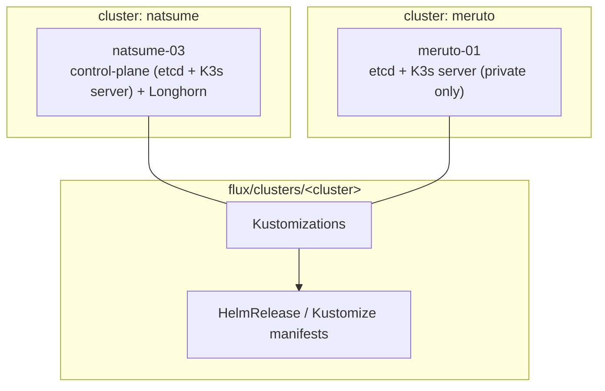
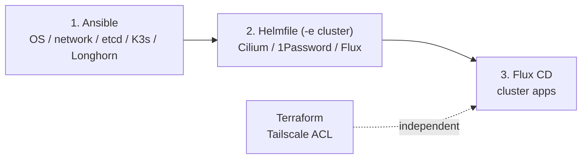

# Polestar Kubernetes Engine (PKE)

**Polestar Kubernetes Engine (PKE)** は、K3s クラスタと周辺アプリケーションをコードで構築・運用するためのリポジトリです。

複数の独立した K3s クラスタを `cluster:` host variable で識別し、Ansible / Helmfile / Flux すべてをクラスター別に切り替えて運用します。クラスタ初期構築は Ansible、CNI と GitOps 基盤のブートストラップは Helmfile (`-e <cluster>`)、クラスタアプリケーションの継続同期は Flux CD で管理します。永続ストレージは Longhorn を Flux 経由で導入し、専用パーティションまたは既存 VG の空き領域をバッキング先として利用します。

## 管理対象クラスタ

| クラスタ | ノード | 役割 | 特記事項 |
|----------|--------|------|----------|
| `natsume` | `natsume-03` | 本番ワークロード / 監視基盤 / DB | Public IP 付き。`natsume-03` が external etcd / K3s server / Longhorn ディスクを持つ |
| `meruto` | `meruto-01` | 単一ノード | Private インターフェースのみ。Longhorn は既存 `ubuntu-vg` の空き領域を利用。Tailscale なし |

各ホストは `host_vars/<host>.yaml` に `cluster: <name>` を必ず設定します。Alloy / etcd / Flux などはこの値を起点にクラスター固有の設定を組み立てます。

## アーキテクチャ概要


```mermaid
flowchart TB
    subgraph Natsume["cluster: natsume"]
        N_CP["natsume-03<br/>control-plane (etcd + K3s server) + Longhorn"]
    end

    subgraph Meruto["cluster: meruto"]
        M_01["meruto-01<br/>etcd + K3s server (private only)"]
    end

    subgraph GitOps["flux/clusters/&lt;cluster&gt;"]
        BASE["Kustomizations"]
        APPS["HelmRelease / Kustomize manifests"]
    end

    N_CP --- BASE
    M_01 --- BASE
    BASE --> APPS
```

## デプロイメントパイプライン


```mermaid
flowchart LR
    A["1. Ansible<br/>OS / network / etcd / K3s / Longhorn"] --> B["2. Helmfile (-e cluster)<br/>Cilium / 1Password / Flux"]
    B --> C["3. Flux CD<br/>cluster apps"]
    D["Terraform<br/>Tailscale ACL"] -. independent .-> C
```

1. **Ansible**: `ansible/site-k3s.yaml` で OS 設定、ネットワーク、UFW、external etcd、K3s server / agent を構築します。Longhorn 用ディスクは `ansible/prepare-longhorn-storage.yaml` で個別に整備します。`--limit <cluster>_etcd` などでクラスター単位に流せます。
2. **Helmfile**: `helmfile -e natsume apply` / `helmfile -e meruto apply` で対応する kubeconfig context (`<cluster>@soli`) に Cilium、1Password Connect、Flux Operator を導入します。
3. **Flux CD**: `helmfile/manifests/flux/<cluster>/fluxinstance.yaml` がクラスター別に `flux/clusters/<cluster>` を同期し、クラスタアプリケーションを GitOps 管理します。
4. **Terraform**: `terraform/tailscale/` で Tailscale ACL を管理します。クラスタ構築パイプラインとは独立しています。

## リポジトリ構成

```
pke/
├── ansible/             # OS・ネットワーク・external etcd・K3s・Alloy・Longhorn ディスクの構成管理
├── helmfile/            # Cilium, 1Password Connect, Flux Operator のブートストラップ
│   ├── helmfile.yaml.gotmpl
│   ├── environments/<cluster>.yaml
│   ├── manifests/flux/<cluster>/fluxinstance.yaml
│   └── values/*.gotmpl
├── flux/clusters/<cluster>/ # Flux CD で同期するクラスタアプリケーション定義
├── terraform/tailscale/ # Tailscale ACL 管理
├── .github/             # GitHub Actions
└── renovate.json5       # 依存関係自動更新設定
```

## 現行バージョン

| コンポーネント | バージョン |
|---------------|-----------|
| K3s | `v1.35.4+k3s1` |
| etcd | `3.6.11` |
| Cilium | `1.19.3` |
| 1Password Connect | `2.4.1` |
| Flux Operator | `0.48.0` |
| Flux distribution | `2.x` |
| Longhorn | `1.11.1` |
| external-dns | `1.21.1` |
| cloudflare-tunnel-ingress-controller | `0.0.23` |
| cloudflared | `2026.3.0` |
| Tailscale Terraform provider | `0.28.0` |

## Ansible

### インベントリ

| パス | 内容 |
|------|------|
| `ansible/inventories/hosts.yaml` | ホストグループ定義 (すべて `all.children` 配下) |
| `ansible/inventories/group_vars/all.yaml` | 共通変数 |
| `ansible/inventories/group_vars/etcd.yaml` | etcd 共通変数 |
| `ansible/inventories/group_vars/k3s_cluster.yaml` | K3s クラスタ共通変数 |
| `ansible/inventories/group_vars/k3s_server.yaml` | K3s server 変数 (`k3s_datastore_endpoint` は `groups[cluster + '_etcd']` から構築) |
| `ansible/inventories/group_vars/k3s_agent.yaml` | K3s agent 変数 (server から node-token を自動取得) |
| `ansible/inventories/group_vars/longhorn_storage.yaml` | Longhorn 用ディスク変数 |
| `ansible/inventories/host_vars/<host>.yaml` | 各ノード固有: `cluster:`、ネットワーク、必要なら `k3s_tls_sans` / `longhorn_storage_use_existing_vg` など |

`hosts.yaml` ではクラスター別の etcd 子グループ (`natsume_etcd` / `meruto_etcd`) を定義し、`etcd` グループはこれらの `children` として束ねます。`setup-etcd` ロールと `k3s_datastore_endpoint` は `groups[cluster + '_etcd']` を参照するため、新規クラスターを追加する場合は host に `cluster: <name>` を設定し `<name>_etcd` グループを作るだけで済みます。

### Playbook

| Playbook | 用途 |
|----------|------|
| `ansible/site-k3s.yaml` | ノード初期設定、ネットワーク、UFW、external etcd、K3s server / agent 構築 (一括) |
| `ansible/prepare-k3s-nodes.yaml` | OS / ネットワーク / sysctl / UFW のみを適用 |
| `ansible/install-k3s-servers.yaml` | 既存ノードに対して K3s server だけを展開 |
| `ansible/prepare-longhorn-storage.yaml` | Longhorn 用パーティション/LV の作成・初期化 |
| `ansible/add-etcd-member.yaml` | 既存 etcd クラスタへの member 追加 (`-e etcd_member_host=<host>`) |
| `ansible/remove-etcd-member.yaml` | 既存 etcd クラスタからの member 削除 (`-e etcd_member_host=<host>`) |
| `ansible/configure-k3s-registry-mtls.yaml` | K3s containerd の private registry mTLS 設定 |
| `ansible/install-alloy.yaml` | Grafana Alloy 導入 (Mimir/Loki に `cluster=<host_vars cluster>` ラベルで送信) |
| `ansible/install-falco.yaml` | Falco 導入 (systemd + modern eBPF、K3s containerd CRI socket、Prometheus metrics) |
| `ansible/install-docker.yaml` | Docker Engine 導入 |
| `ansible/upgrade-k3s.yaml` | K3s アップグレード |
| `ansible/upgrade-etcd.yaml` | etcd アップグレード |

`ansible/configure-k3s-registry-mtls.yaml` は新規クラスタ構築のデッドロックを避けるため、`site-k3s.yaml` には含めません。K3s、Flux、`registry.str08.net`、mTLS client 証明書の準備後に単独で実行します。

複数クラスターを 1 つの inventory で管理しているため、`-l <cluster>_etcd` や `-l <ホスト>` で対象を絞って実行します (例: `ansible-playbook -i ansible/inventories/hosts.yaml -l meruto-01 ansible/site-k3s.yaml`)。

Falco は Kubernetes DaemonSet ではなく host systemd service として導入します。K3s の admin kubeconfig は渡さず、Kubernetes / container metadata は K3s containerd の CRI socket (`/run/k3s/containerd/containerd.sock`) から取得します。custom rules は host 側の `/etc/falco/rules.d` に配置する前提で、必要になった時点で Ansible 管理を追加します。

### Roles

| Role | 用途 / 主な変数 |
|------|---------------|
| `general-configuration` | 基本 OS 設定 |
| `network` | Netplan 設定。`network_netplan.<global\|private>` の `device` / `ipv4` / `ipv6` / `default_route` / `nameservers` / `routes` / `dhcp4` / `dhcp6` / `accept_ra` をホスト別に指定可能 |
| `sysctl` | カーネルパラメータ |
| `ufw` | Firewall。`ufw_global_interface` が空のホスト (private-only) ではグローバル向けルールを自動スキップ |
| `setup-etcd` | external etcd の初期構築。`groups[cluster + '_etcd']` をリーダー選出と initial-cluster 構築に使用 |
| `etcd-maintenance` | etcd snapshot などの保守 |
| `etcd-precheck` | etcd ヘルスチェック |
| `etcd-member` | 稼働中 etcd クラスタへの member 追加 / 削除 |
| `install-k3s` | K3s server / agent 導入。`k3s_token` 未指定時は k3s が自動生成。`k3s_external_ip_netplan_source` (`global` / `private` / `""`) と `k3s_external_ip_include_ipv4` / `k3s_external_ip_include_ipv6` で `node-external-ip` を制御。`k3s_include_tailscale_tls_sans: false` で Tailscale 不在ホストに対応 |
| `configure-k3s-registry-mtls` | K3s containerd の private registry mTLS 設定 |
| `longhorn-storage` | Longhorn 用ディスクのパーティション作成・XFS/ext4 初期化・マウント。`longhorn_storage_use_existing_vg: true` で既存 VG (`longhorn_storage_vg_name`) の空き領域に LV を切るモードに切り替え |
| `install-alloy` | Grafana Alloy 導入。`cluster_name` ハードコードを廃止し、host_vars の `cluster` を Mimir/Loki ラベルとして送信 |
| `install-falco` | Falco を systemd service として導入。`falco_driver_choice: modern_ebpf`、`falco_cri_socket: /run/k3s/containerd/containerd.sock`、`falco_metrics_*` で metrics endpoint を制御 |
| `install-docker` | Docker Engine 導入 |
| `upgrade-k3s` | K3s アップグレード |
| `upgrade-etcd` | etcd アップグレード |

## Helmfile Bootstrap

`helmfile/helmfile.yaml.gotmpl` は K3s 構築後に必要な基盤コンポーネントを導入します。`-e <cluster>` でクラスターを切り替えます。

```bash
helmfile -e natsume apply   # context: natsume@soli
helmfile -e meruto  apply   # context: meruto@soli
```

| Release | Namespace | Version | 用途 |
|---------|-----------|---------|------|
| `cilium` | `kube-system` | `1.19.3` | CNI |
| `connect` | `1password` | `2.4.1` | 1Password Connect |
| `flux-operator` | `flux-system` | `0.48.0` | Flux Operator |

| ファイル | 内容 |
|----------|------|
| `helmfile/environments/<cluster>.yaml` | Cilium CIDR、1Password アイテム名、kubeconfig context などクラスター別の値 |
| `helmfile/manifests/flux/<cluster>/fluxinstance.yaml` | クラスター別 `FluxInstance`。`spec.sync.path` が `flux/clusters/<cluster>` を指す |
| `helmfile/values/cilium.gotmpl` | env から CIDR を参照する Cilium values |
| `helmfile/values/1password-connect.gotmpl` | env から 1Password アイテム名を参照する values |

`helmDefaults.kubeContext` は env の `kubeContext` を流用するため、`helmfile -e <cluster>` を指定すれば対応する kubeconfig context (`<cluster>@soli`) に対して動作します。Flux Operator の postsync hook は `helmfile/manifests/flux/{{ .Environment.Name }}/fluxinstance.yaml` を適用します。

## Flux CD

Flux のクラスタ定義は `flux/clusters/<cluster>/` に配置します (`natsume` / `meruto` の 2 クラスター)。

| パス | 内容 |
|------|------|
| `flux/clusters/<cluster>/kustomization.yaml` | Flux Kustomization 一覧のルート |
| `flux/clusters/<cluster>/kustomizations/*.yaml` | アプリごとの Flux `Kustomization` |
| `flux/clusters/<cluster>/apps/<app>/` | アプリごとの Namespace、HelmRepository、HelmRelease、追加 manifest |

各 Flux `Kustomization` は基本的に `interval: 10m`, `prune: true`, `wait: true` で管理し、依存関係は `dependsOn` で表現します。

### natsume クラスターの管理コンポーネント

| 分類 | コンポーネント |
|------|---------------|
| 基盤 / CRD | `cnpg`, `cnpg-backup-config`, `cert-manager`, `cert-manager-config`, `prometheus-operator-crd` |
| ストレージ | `longhorn`, `longhorn-config` |
| ネットワーク | `traefik`, `external-dns`, `external-dns-config` |
| 監視 | `grafana`, `mimir`, `loki`, `alloy`, `kube-state-metrics` |
| アプリ | `misskey`, `navidrome`, `note-tweet-connector`, `registry`, `spotify-nowplaying`, `spotify-reblend`, `sui`, `summaly` |

`external-dns-config` はクラスタ入口とノードの DNS レコードを `DNSEndpoint` で宣言します。`cnpg-backup-config` は CNPG の barman-cloud バックアップで共通利用する R2 認証情報 (`OnePasswordItem` 経由) を集約します。`cert-manager-config` には `letsencrypt-dns01` / `letsencrypt-http01` の ClusterIssuer に加え、Traefik mTLS 用の自己署名 CA / Certificate / TLSOption (`pke-natsume-mtls`) が含まれます。

### meruto クラスターの管理コンポーネント

| 分類 | コンポーネント |
|------|---------------|
| 基盤 / CRD | `cnpg`, `cert-manager`, `cert-manager-config` (dns01 ClusterIssuer のみ), `external-secrets`, `prometheus-operator-crd` |
| ストレージ | `longhorn`, `longhorn-config` |
| ネットワーク | `traefik`, `external-dns`, `cloudflare-tunnel-ingress-controller` |
| 監視 | `alloy`, `kube-state-metrics`, `prometheus-blackbox-exporter`, `blackbox-exporter-probes`, `ix2215-snmp-exporter`, `vector` |
| アプリ | `daypassed-bot`, `emoji-service`, `mc-mirror-cronjob`, `mk-stream`, `rss-fetcher` |
| 運用 | `renovate-operator` |

natsume との主な差分:

- **longhorn**: 単一ノード構成のため `defaultClassReplicaCount: 1`、Ingress 無効。`createDefaultDiskLabeledNodes: true` のため、`meruto-01` には `node.longhorn.io/create-default-disk=true` ラベルを付けて `/var/lib/longhorn` の default disk を作成する
- **external-dns**: `txtPrefix: meruto-` で natsume レコードと衝突回避し、`extraArgs.ingress-class: traefik` で Traefik Ingress のみを対象にする
- **cloudflare-tunnel-ingress-controller**: `cloudflared-pke-meruto` `OnePasswordItem` を参照し、Cloudflare Tunnel 経由の IngressClass `cloudflare-tunnel` を提供する。controller chart は `0.0.23`、管理する `cloudflared` image tag は `2026.3.0`
- **cert-manager-config**: `letsencrypt-dns01` ClusterIssuer + `cloudflare-api-token` `OnePasswordItem` のみ。`letsencrypt-http01` と Traefik mTLS 用の CA / TLSOption は含まない
- **ix2215-snmp-exporter / vector**: IX2215 (`192.168.10.1`) の SNMP メトリクスと syslog を収集する。SNMP exporter の設定は `ix2215-snmp-exporter-config`、vector の Loki 送信 mTLS は `pke_natsume_mtls` の `OnePasswordItem` を参照する
- **renovate-operator**: GitHub App token 生成に External Secrets Operator の `GithubAccessToken` generator を使う。Ingress は Traefik (`ingressClassName: traefik`) と `letsencrypt-dns01`
- 含まれないコンポーネント: `cnpg-backup-config`, `external-dns-config`, Mimir / Loki / Grafana 等の natsume 側監視スタック

### CloudNativePG クラスタ

Postgres を必要とする natsume のアプリは CNPG `Cluster` を `apps/<app>/cluster.yaml` に同梱しています。現行の `grafana` / `misskey` / `spotify-nowplaying` / `spotify-reblend` / `sui` クラスタはいずれも `instances: 1` です。`misskey` は `barman-cloud.cloudnative-pg.io` plugin で R2 互換ストレージへ日次 base backup と WAL アーカイブ (`apps/misskey/scheduledbackup.yaml` + `apps/misskey/objectstore.yaml`、retention `7d`) を取得します。`grafana` / `spotify-nowplaying` / `spotify-reblend` / `sui` は日次 `pg_dump` CronJob で R2 にバックアップします。`misskey` クラスタは pgroonga 拡張を含む `ghcr.io/soli0222/pgroonga-cnpg` イメージを使用し、永続ストレージは 150Gi で動作します。バックアップ運用の詳細とリストア手順は [CNPG.md](./CNPG.md) を参照してください。

## ネットワーク

### natsume クラスター

| 項目 | 値 |
|------|----|
| ノード | `natsume-03` |
| Public IPv4 | `133.18.141.63/23` |
| Public IPv6 | `2406:8c00:0:3464:133:18:141:63/64` |
| Private IPv4 | `192.168.9.3/24` |
| Private IPv6 | `fd00:192:168:9::3/64` |

### meruto クラスター

| 項目 | 値 |
|------|----|
| ノード | `meruto-01` (single-node, private only) |
| Private IPv4 | `192.168.10.3/24` |
| Private IPv6 | `fd00:192:168:10::3/64` |

### 共通

| 項目 | 値 |
|------|----|
| Pod CIDR | `10.1.0.0/16`, `fd00:10:1::/64` |
| Service CIDR | `10.2.0.0/16`, `fd00:10:2::/64` |
| Cluster DNS | `10.2.0.10`, `fd00:10:2::a` |

K3s built-in の `traefik` と `helm-controller` は無効化しています。Ingress と Helm release は Flux 側で管理します。natsume クラスターでは入口とノードの DNS レコードを `flux/clusters/natsume/apps/external-dns-config/node-dnsendpoints.yaml` で宣言し external-dns が反映します。meruto クラスターは Public IP を持たないため `external-dns-config` は同梱せず、external-dns 自体は `txtPrefix: meruto-` で動作させます (Ingress / Service による DNS 同期のみ、ノードレコードは未管理)。

## ストレージ

- ストレージドライバは Longhorn (`flux/clusters/<cluster>/apps/longhorn`)。HelmRelease で `longhorn` chart `1.11.1` を導入します。
- natsume クラスター: `longhorn_storage` グループに所属する `natsume-03` で `/dev/vda` の 4 番パーティションを切り出し、新規 VG `longhorn` 上に LV を作成します。Longhorn の default replica count は `1` です。
- meruto クラスター: `meruto-01` では `longhorn_storage_use_existing_vg: true` により、既存 `ubuntu-vg` の空き領域に LV `data` (100%FREE) を切ってマウントします。パーティション操作は行いません。Longhorn の default replica count は `1` で、default disk 自動作成には node label `node.longhorn.io/create-default-disk=true` が必要です。

## Terraform

`terraform/tailscale/` は Tailscale ACL を管理します。

- Provider: `tailscale/tailscale` `0.28.0`
- State backend: Cloudflare R2 の S3 互換 backend
- 認証情報: `TAILSCALE_API_KEY` などの環境変数で注入
- 補助スクリプト: `setup.sh`, `import_acl.sh`

## CI/CD と Renovate

- Renovate は Terraform、Helmfile、Helm values、Ansible、GitHub Actions、custom regex を対象に依存関係を更新します。
- `renovate.json5` には K3s と etcd の Ansible 変数を追跡する custom manager があります。
- GitHub Actions:
  - `.github/workflows/lint-gha-workflows.yaml`: actionlint による workflow lint
  - `.github/workflows/flux-diff.yaml`: PR 上で `flux-local` による HelmRelease / Kustomization の diff コメント

## 運用メモ

- シークレットは主に 1Password Operator の `OnePasswordItem` で生成します。External Secrets Operator は meruto の `renovate-operator` で GitHub App token generator に使用しています。平文 Secret はコミットしないでください。
- K3s と etcd のアップグレードは `ansible/upgrade-k3s.yaml` と `ansible/upgrade-etcd.yaml` を使います。
- 新規クラスター追加は: `hosts.yaml` に `<name>_etcd` 子グループを作成 → host_vars に `cluster: <name>` 等を設定 → `helmfile/environments/<name>.yaml` と `helmfile/manifests/flux/<name>/fluxinstance.yaml` を追加 → `flux/clusters/<name>/` を作成、の流れになります。
- ノード追加 / 削除は etcd → K3s server / agent → Longhorn ディスクの順で playbook を分けて流し、`hosts.yaml` と `host_vars/<node>.yaml` の追記を忘れないでください。natsume クラスターでは加えて `flux/clusters/natsume/apps/external-dns-config/node-dnsendpoints.yaml` のレコード更新が必要です (meruto クラスターは `external-dns-config` を持たないため不要)。
- 新しい Flux アプリを追加する場合は `apps/<app>/`、`kustomizations/<app>.yaml`、ルート `kustomization.yaml` の 3 箇所をそろえてください。Postgres を使うアプリでは CNPG `Cluster` と必要に応じて barman-cloud `ObjectStore` / `ScheduledBackup` を同じディレクトリに同梱します。
- Terraform state は Cloudflare R2 backend に保存されます。
