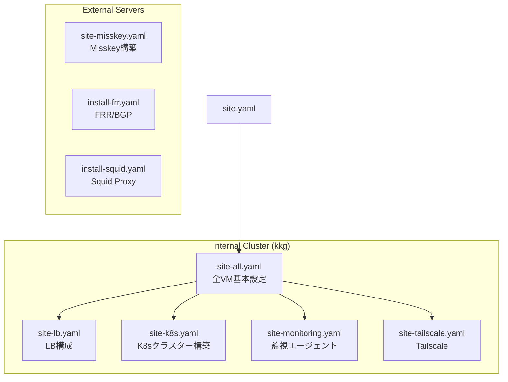
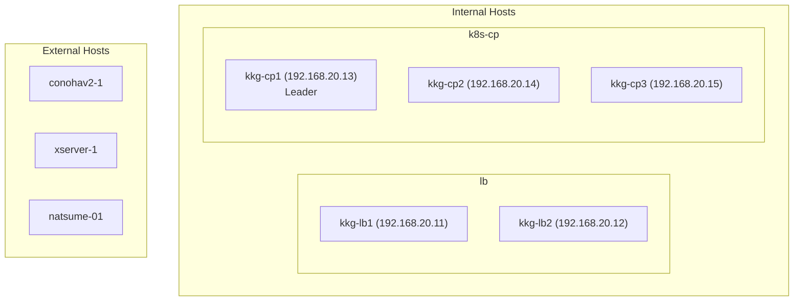

# PKE Ansible Automation

Kubernetes クラスター（kkg）および外部サーバーのセットアップと管理を自動化する Ansible プレイブックとロールです。

## 概要



### 自動化対象

- **ロードバランサー**: HAProxy + Keepalived + FRR/BGP による高可用性 LB
- **Kubernetes クラスター**: containerd ランタイムを使用したマルチマスター構成
- **ベースシステム**: セキュリティ設定、システム最適化、必要パッケージのインストール
- **監視**: Alloy エージェントの配布
- **ネットワーク**: Tailscale、FRR/BGP
- **外部サーバー**: Misskey、Docker、Nginx、certbot 等

## ディレクトリ構造

```
ansible/
├── ansible.cfg                 # Ansible設定ファイル
├── site.yaml                   # メインプレイブック（全内部VM）
├── site-all.yaml               # 全VM基本設定
├── site-lb.yaml                # ロードバランサー設定
├── site-k8s.yaml               # Kubernetesクラスター設定
├── site-monitoring.yaml        # 監視エージェント設定
├── site-tailscale.yaml         # Tailscaleネットワーク設定
├── site-misskey.yaml           # Misskeyサーバー構築
├── install-frr.yaml            # FRR/BGPインストール
├── install-squid.yaml          # Squid Proxyインストール
├── upgrade-k8s.yaml            # Kubernetesアップグレード
├── upgrade-containerd.yaml     # containerdアップグレード
├── upgrade-misskey.yaml        # Misskeyアップグレード
│
├── inventories/
│   ├── kkg                     # メインインベントリファイル
│   ├── group_vars/
│   │   ├── all.yaml            # グローバル設定
│   │   ├── internal.yaml       # 内部クラスター設定
│   │   ├── external.yaml       # 外部ノード設定
│   │   └── lb.yml              # ロードバランサーグループ設定
│   └── host_vars/
│       ├── kkg-lb1.yml         # lb1固有設定
│       ├── kkg-lb2.yml         # lb2固有設定
│       └── natsume-01.yaml     # Misskeyサーバー固有設定
│
└── roles/
    ├── all-vm-config/               # 全VM共通設定
    ├── configure-iptables-for-external/ # 外部接続iptables設定
    ├── configure-misskey-host/      # Misskeyホスト設定
    ├── configure-tailscale/         # Tailscale設定
    ├── init-cp-kubernetes/          # Kubernetesクラスター初期化
    ├── install-alloy/               # Alloy監視エージェント
    ├── install-certbot/             # Let's Encrypt証明書
    ├── install-containerd/          # containerdコンテナランタイム
    ├── install-docker/              # Docker
    ├── install-falco/               # Falcoセキュリティ
    ├── install-frr/                 # FRR/BGPルーティング
    ├── install-haproxy/             # HAProxyロードバランサー
    ├── install-keepalived/          # Keepalived高可用性
    ├── install-kubernetes/          # Kubernetesコンポーネント
    ├── install-misskey/             # Misskeyインストール
    ├── install-nginx/               # Nginx Webサーバー
    ├── install-rclone/              # Rcloneストレージ同期
    ├── install-squid/               # Squid Proxy
    ├── install-tailscale/           # Tailscaleネットワーキング
    ├── join-cp-kubernetes/          # コントロールプレーン参加
    ├── join-wk-kubernetes/          # ワーカーノード参加
    └── upgrade-kubernetes/          # Kubernetesアップグレード
```

## インベントリ構造



### ホストグループ定義

| グループ | ホスト | 用途 |
|---------|-------|------|
| `internal` | kkg-lb1, lb2, cp1, cp2, cp3 | 内部クラスターノード |
| `lb` | kkg-lb1, kkg-lb2 | ロードバランサー |
| `lb-leader` | kkg-lb1 | LBリーダー |
| `k8s` | kkg-cp1, cp2, cp3 | 全Kubernetesノード |
| `k8s-cp` | kkg-cp1, cp2, cp3 | コントロールプレーン |
| `k8s-cp-leader` | kkg-cp1 | CPリーダー |
| `k8s-cp-follower` | kkg-cp2, cp3 | CPフォロワー |
| `external` | conohav2-1, xserver-1, natsume-01 | 外部サーバー |
| `misskey` | xserver-1, natsume-01 | Misskeyサーバー |
| `tailscale-internal` | kkg-lb1, kkg-lb2 | Tailscale内部ノード |
| `tailscale-external` | conohav2-1 | Tailscale外部ノード |

## ロール一覧

| ロール | 説明 | 対象 |
|--------|------|------|
| `all-vm-config` | カーネルモジュール、sysctl、パッケージ更新 | internal |
| `install-containerd` | containerd コンテナランタイム | k8s |
| `install-kubernetes` | kubelet、kubeadm、kubectl | k8s |
| `init-cp-kubernetes` | Kubernetes クラスター初期化 | k8s-cp-leader |
| `join-cp-kubernetes` | コントロールプレーン参加 | k8s-cp-follower |
| `join-wk-kubernetes` | ワーカーノード参加 | k8s-wk |
| `install-haproxy` | HAProxy ロードバランサー | lb |
| `install-keepalived` | Keepalived 高可用性 | lb |
| `install-frr` | FRR/BGP ルーティング | lb |
| `install-alloy` | Alloy 監視エージェント | internal |
| `install-tailscale` | Tailscale インストール | tailscale-* |
| `configure-tailscale` | Tailscale 設定 | tailscale-* |
| `configure-iptables-for-external` | 外部接続用 iptables | external |
| `install-docker` | Docker エンジン | misskey |
| `install-nginx` | Nginx Web サーバー | external |
| `install-certbot` | Let's Encrypt 証明書 | external |
| `install-misskey` | Misskey インストール | misskey |
| `configure-misskey-host` | Misskey ホスト設定 | misskey |
| `install-rclone` | Rclone ストレージ同期 | external |
| `install-squid` | Squid Proxy | 指定ノード |
| `install-falco` | Falco セキュリティ | 指定ノード |
| `upgrade-kubernetes` | Kubernetes アップグレード | k8s |

## 主要な設定変数

### 内部クラスター設定 (group_vars/internal.yaml)

```yaml
# ソフトウェアバージョン
containerd_version: "2.2.1"
runc_version: "1.4.0"
cni_plugins_version: "1.9.0"
kubernetes_version: 1.35.1

# ネットワーク
pod_network_cidr: 10.26.0.0/16
lb_virtual_ip: "192.168.20.10"
controlplane_endpoint: "192.168.20.10:6443"

# 監視
mimir_endpoint: "https://mimir.str08.net/api/v1/push"
loki_endpoint: "https://loki.str08.net/api/v1/push"
```

### ロードバランサー設定 (group_vars/lb.yml)

```yaml
lb_interface: eth0
lb_virtual_router_id: 10
haproxy_backend_port: 6443

# FRR BGP
frr_local_asn: 65002
frr_bgp_peers:
  - { name: kkg-cp1, address: 192.168.20.13, remote_asn: 65001 }
  - { name: kkg-cp2, address: 192.168.20.14, remote_asn: 65001 }
  - { name: kkg-cp3, address: 192.168.20.15, remote_asn: 65001 }
```

### 外部サーバー設定 (group_vars/external.yaml)

```yaml
tls_cert_path: "/etc/cert/pstr.space/tls.pem"
tls_key_path: "/etc/cert/pstr.space/tls.key"
mimir_endpoint: "https://mimir.pstr.space/api/v1/push"
loki_endpoint: "https://loki.pstr.space/loki/api/v1/push"
```

## 使用方法

### 前提条件

- Ansible 2.9+
- Python 3.8+（仮想環境推奨）
- 全ノードへの SSH 鍵認証設定
- sudo 権限を持つユーザー

### クラスター構築

```bash
# 全コンポーネントを一括セットアップ
ansible-playbook -i inventories/kkg site.yaml

# ステップバイステップ
ansible-playbook -i inventories/kkg site-all.yaml        # 1. 基本設定
ansible-playbook -i inventories/kkg site-lb.yaml         # 2. ロードバランサー
ansible-playbook -i inventories/kkg site-k8s.yaml        # 3. Kubernetesクラスター
ansible-playbook -i inventories/kkg site-monitoring.yaml # 4. 監視エージェント
ansible-playbook -i inventories/kkg site-tailscale.yaml  # 5. Tailscale（必要に応じて）
```

### 外部サーバー

```bash
# Misskeyサーバー構築
ansible-playbook -i inventories/kkg site-misskey.yaml

# FRR/BGPインストール
ansible-playbook -i inventories/kkg install-frr.yaml

# Squid Proxyインストール
ansible-playbook -i inventories/kkg install-squid.yaml
```

### アップグレード

```bash
ansible-playbook -i inventories/kkg upgrade-k8s.yaml         # Kubernetes
ansible-playbook -i inventories/kkg upgrade-containerd.yaml   # containerd
ansible-playbook -i inventories/kkg upgrade-misskey.yaml      # Misskey
```

### トラブルシューティング

```bash
# 全ホストへの接続確認
ansible -i inventories/kkg all -m ping

# 詳細ログ付きで実行
ansible-playbook -i inventories/kkg site.yaml -vvv

# 特定のタスクから再開
ansible-playbook -i inventories/kkg site.yaml --start-at-task="タスク名"
```

## 設計原則

- **DRY**: IP アドレスは各ホストで一度だけ定義。HAProxy バックエンドは `k8s-cp` グループから動的生成
- **分離された設定**: グローバル / グループ / ホスト固有の変数を適切に分離
- **スケーラビリティ**: ホスト追加時にインベントリとグループへの追加のみで対応可能
