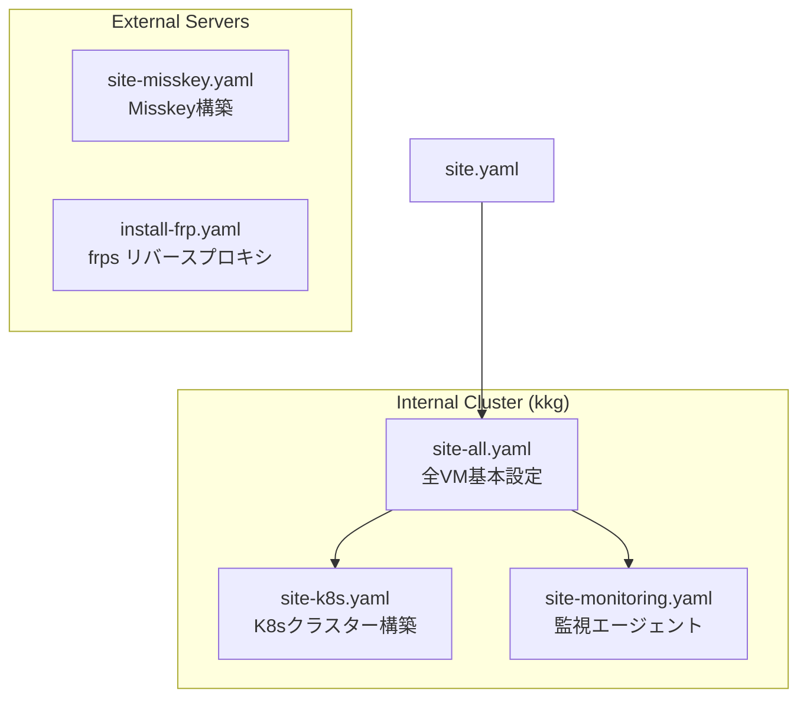
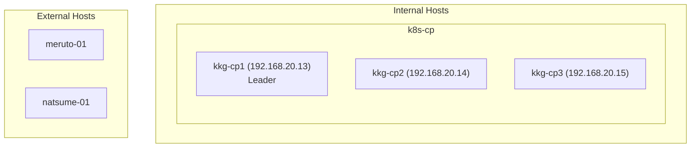

# PKE Ansible Automation

Kubernetes クラスター（kkg）および外部サーバーのセットアップと管理を自動化する Ansible プレイブックとロールです。

## 概要


```mermaid
flowchart TB
    subgraph "Internal Cluster (kkg)"
        direction TB
        ALL[site-all.yaml<br/>全VM基本設定]
        ALL --> K8S[site-k8s.yaml<br/>K8sクラスター構築]
        ALL --> MON[site-monitoring.yaml<br/>監視エージェント]
    end

    subgraph "External Servers"
        MISSKEY[site-misskey.yaml<br/>Misskey構築]
        FRP[install-frp.yaml<br/>frps リバースプロキシ]
    end

    SITE[site.yaml] --> ALL
```

### 自動化対象

- **Kubernetes クラスター**: containerd ランタイムを使用したマルチマスター構成（kube-vip による API VIP 管理）
- **ベースシステム**: セキュリティ設定、システム最適化、必要パッケージのインストール
- **監視**: Alloy エージェントの配布
- **ネットワーク**: Cilium、frp リバースプロキシ
- **外部サーバー**: Misskey、Docker、Nginx、certbot 等

## ディレクトリ構造

```
ansible/
├── ansible.cfg                 # Ansible設定ファイル
├── site.yaml                   # メインプレイブック（全内部VM）
├── site-all.yaml               # 全VM基本設定
├── site-k8s.yaml               # Kubernetesクラスター設定
├── site-monitoring.yaml        # 監視エージェント設定
├── site-misskey.yaml           # Misskeyサーバー構築
├── install-frp.yaml            # frpsインストール
├── upgrade-k8s.yaml            # Kubernetesアップグレード
├── upgrade-kube-vip.yaml       # kube-vipマニフェスト更新
├── upgrade-containerd.yaml     # containerdアップグレード
├── upgrade-misskey.yaml        # Misskeyアップグレード
│
├── inventories/
│   ├── kkg                     # メインインベントリファイル
│   ├── group_vars/
│   │   ├── all.yaml            # グローバル設定
│   │   ├── internal.yaml       # 内部クラスター設定
│   │   └── external.yaml       # 外部ノード設定
│   └── host_vars/
│       └── natsume-01.yaml     # Misskeyサーバー固有設定
│
└── roles/
    ├── all-vm-config/               # 全VM共通設定
    ├── bootstrap-etcd-certs/        # etcd証明書ブートストラップ
    ├── configure-frp-host/          # frpホスト設定
    ├── configure-misskey-host/      # Misskeyホスト設定
    ├── etcd-maintenance/            # etcdメンテナンス
    ├── etcd-precheck/               # etcdアップグレード前チェック
    ├── init-cp-kubernetes/          # Kubernetesクラスター初期化
    ├── install-alloy/               # Alloy監視エージェント
    ├── install-certbot/             # Let's Encrypt証明書
    ├── install-containerd/          # containerdコンテナランタイム
    ├── install-docker/              # Docker
    ├── install-etcd-systemd/        # 外部etcd（systemd管理）
    ├── install-falco/               # Falcoセキュリティ
    ├── install-frp/                 # frpsリバースプロキシ
    ├── install-k8s-tracing/         # Kubernetesトレーシング設定
    ├── install-kube-vip/            # kube-vip static pod 配置
    ├── install-kubernetes/          # Kubernetesコンポーネント
    ├── install-misskey/             # Misskeyインストール
    ├── install-nginx/               # Nginx Webサーバー
    ├── install-rclone/              # Rcloneストレージ同期
    ├── join-cp-kubernetes/          # コントロールプレーン参加
    ├── join-wk-kubernetes/          # ワーカーノード参加
    ├── migrate-etcd-to-systemd/     # stacked→外部etcd移行
    ├── reconfigure-kubeadm-external-etcd/ # kubeadm外部etcd再設定
    ├── upgrade-etcd/                # etcdアップグレード
    └── upgrade-kubernetes/          # Kubernetesアップグレード
```

## インベントリ構造


```mermaid
graph TB
    subgraph "Internal Hosts"
        subgraph "k8s-cp"
            CP1["kkg-cp1 (192.168.20.13)<br/>Leader"]
            CP2["kkg-cp2 (192.168.20.14)"]
            CP3["kkg-cp3 (192.168.20.15)"]
        end
    end

    subgraph "External Hosts"
        MERUTO["meruto-01"]
        NATSUME["natsume-01"]
    end
```

### ホストグループ定義

| グループ | ホスト | 用途 |
|---------|-------|------|
| `internal` | kkg-cp1, cp2, cp3 | 内部クラスターノード |
| `k8s` | kkg-cp1, cp2, cp3 | 全Kubernetesノード |
| `k8s-cp` | kkg-cp1, cp2, cp3 | コントロールプレーン |
| `k8s-cp-leader` | kkg-cp1 | CPリーダー |
| `k8s-cp-follower` | kkg-cp2, cp3 | CPフォロワー |
| `external` | meruto-01, natsume-01 | 外部サーバー |
| `frp` | meruto-01 | frps リバースプロキシ |
| `misskey` | natsume-01 | Misskeyサーバー |

## ロール一覧

| ロール | 説明 | 対象 |
|--------|------|------|
| `all-vm-config` | カーネルモジュール、sysctl、パッケージ更新 | internal |
| `install-containerd` | containerd コンテナランタイム | k8s |
| `install-kube-vip` | kube-vip static pod で API VIP を提供 | k8s-cp |
| `install-kubernetes` | kubelet、kubeadm、kubectl | k8s |
| `bootstrap-etcd-certs` | etcd 証明書ブートストラップ | k8s-cp |
| `install-etcd-systemd` | 外部 etcd（systemd 管理） | k8s-cp |
| `init-cp-kubernetes` | Kubernetes クラスター初期化 | k8s-cp-leader |
| `join-cp-kubernetes` | コントロールプレーン参加 | k8s-cp-follower |
| `join-wk-kubernetes` | ワーカーノード参加 | k8s-wk |
| `install-alloy` | Alloy 監視エージェント | all |
| `install-k8s-tracing` | Kubernetes トレーシング設定 | k8s |
| `install-frp` | frps リバースプロキシ | frp |
| `configure-frp-host` | frp ホスト設定 | frp |
| `install-docker` | Docker エンジン | misskey, frp |
| `install-nginx` | Nginx Web サーバー | external |
| `install-certbot` | Let's Encrypt 証明書 | external |
| `install-misskey` | Misskey インストール | misskey |
| `configure-misskey-host` | Misskey ホスト設定 | misskey |
| `install-rclone` | Rclone ストレージ同期 | external |
| `install-falco` | Falco セキュリティ | 指定ノード |
| `upgrade-kubernetes` | Kubernetes アップグレード | k8s |
| `upgrade-etcd` | etcd アップグレード | k8s-cp |
| `etcd-maintenance` | etcd デフラグ・スナップショット | k8s-cp |
| `etcd-precheck` | etcd アップグレード前チェック | k8s-cp |
| `migrate-etcd-to-systemd` | stacked → 外部 etcd 移行 | k8s-cp |
| `reconfigure-kubeadm-external-etcd` | kubeadm 外部 etcd 再設定 | k8s-cp |

## 主要な設定変数

### 内部クラスター設定 (group_vars/internal.yaml)

```yaml
# ソフトウェアバージョン
containerd_version: "2.2.2"
runc_version: "1.4.1"
cni_plugins_version: "1.9.1"
kubernetes_version: 1.35.3
etcd_version: "3.6.9"

# ネットワーク
pod_network_cidr: 10.26.0.0/16
lb_virtual_ip: "192.168.20.10"
controlplane_endpoint: "192.168.20.10:6443"

# 監視
mimir_endpoint: "https://mimir.str08.net/api/v1/push"
loki_endpoint: "https://loki.str08.net/api/v1/push"
tempo_endpoint: "https://tempo.str08.net"
```

### 外部サーバー設定 (group_vars/external.yaml)

```yaml
tls_cert_path: "/etc/cert/pstr.space/tls.pem"
tls_key_path: "/etc/cert/pstr.space/tls.key"
mimir_endpoint: "https://mimir.pstr.space/api/v1/push"
loki_endpoint: "https://loki.pstr.space/loki/api/v1/push"
```

## 使用方法

### 前提条件

- Ansible 2.9+
- Python 3.8+（仮想環境推奨）
- 全ノードへの SSH 鍵認証設定
- sudo 権限を持つユーザー

### クラスター構築

```bash
# 全コンポーネントを一括セットアップ
ansible-playbook -i inventories/kkg site.yaml

# ステップバイステップ
ansible-playbook -i inventories/kkg site-all.yaml        # 1. 基本設定
ansible-playbook -i inventories/kkg site-k8s.yaml        # 2. Kubernetesクラスター
ansible-playbook -i inventories/kkg site-monitoring.yaml # 3. 監視エージェント
```

### 外部サーバー

```bash
# Misskeyサーバー構築
ansible-playbook -i inventories/kkg site-misskey.yaml

# frpsインストール
ansible-playbook -i inventories/kkg install-frp.yaml
```

### アップグレード

```bash
ansible-playbook -i inventories/kkg upgrade-k8s.yaml         # Kubernetes
ansible-playbook -i inventories/kkg upgrade-kube-vip.yaml    # kube-vip
ansible-playbook -i inventories/kkg upgrade-containerd.yaml   # containerd
ansible-playbook -i inventories/kkg upgrade-misskey.yaml      # Misskey
```

### トラブルシューティング

```bash
# 全ホストへの接続確認
ansible -i inventories/kkg all -m ping

# 詳細ログ付きで実行
ansible-playbook -i inventories/kkg site.yaml -vvv

# 特定のタスクから再開
ansible-playbook -i inventories/kkg site.yaml --start-at-task="タスク名"
```

## 設計原則

- **DRY**: IP アドレスは各ホストで一度だけ定義。Control Plane VIP は `controlplane_endpoint` と `lb_virtual_ip` に集約
- **分離された設定**: グローバル / グループ / ホスト固有の変数を適切に分離
- **スケーラビリティ**: ホスト追加時にインベントリとグループへの追加のみで対応可能
