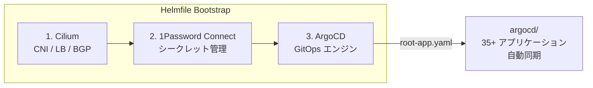
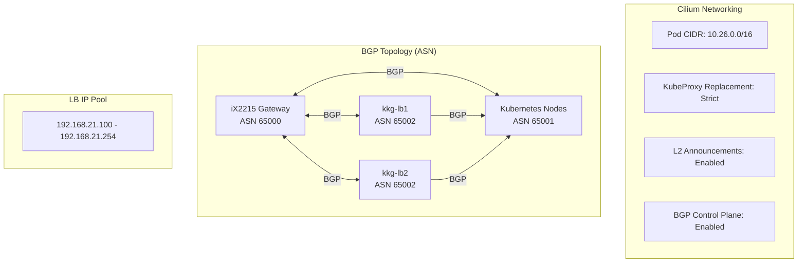

# PKE Helmfile Configuration

Kubernetes クラスターの**ブートストラップ（初期構築）**を行うための Helmfile 設定です。

## 概要



Helmfile の役割は以下のブートストラップコンポーネントのデプロイに限定されています。その他のアプリケーション・プラットフォームコンポーネントは ArgoCD が `argocd/` ディレクトリから自動管理します。

### 管理対象コンポーネント

| 順序 | コンポーネント | Chart Version | 用途 |
|------|---------------|---------------|------|
| 1 | Cilium | 1.19.0 | CNI / NetworkPolicy / LoadBalancer (L2 + BGP) |
| 2 | 1Password Connect | 2.3.0 | シークレット管理基盤 |
| 3 | ArgoCD | 9.4.2 | GitOps CD エンジン |

## ディレクトリ構造

```
helmfile/
├── helmfile.yaml                    # メインHelmfile設定
├── 1password-credentials.json       # 1Password Connect認証情報（要手動配置）
│
├── values/
│   ├── cilium.gotmpl               # Cilium CNI設定
│   ├── 1password-connect.gotmpl    # 1Password Connect設定
│   └── argocd.gotmpl               # ArgoCD設定
│
└── manifests/
    ├── argocd/
    │   └── root-app.yaml           # ArgoCD App of Apps ルートアプリケーション
    └── cilium/
        ├── default-pool.yaml       # Cilium LoadBalancer IPPool
        └── bgp.yaml                # BGP ClusterConfig / PeerConfig / Advertisement
```

## Cilium 設定詳細



- **IP Allocation**: cluster-pool（10.26.0.0/16）
- **Routing**: Native routing
- **KubeProxy**: Strict replacement（K8s API: 192.168.20.10:6443）
- **LB IP Pool**: 192.168.21.100 - 192.168.21.254
- **BGP**: Cilium BGP Control Plane で LoadBalancer IP を広報
- **Hubble**: UI 有効（hubble.str08.net）、メトリクス収集（DNS/Drop/TCP/Flow/HTTP）

## 前提条件

- Kubernetes クラスターが Ansible で構築済みであること
- Helmfile (v0.165.0+)
- Helm (v3.10+)
- kubectl（クラスターへの接続設定済み）
- 1Password CLI（`op` コマンド）

## デプロイ手順

### 1. 1Password Connect 準備

`1password-credentials.json` を `helmfile/` ディレクトリに配置します。

### 2. 環境変数設定

```bash
export ONEPASSWORD_TOKEN="<your-token>"
```

### 3. デプロイ実行

```bash
# 依存関係順に個別実行
helmfile -l name=cilium apply    # 1. CNI
helmfile -l name=connect apply   # 2. シークレット基盤
helmfile -l name=argocd apply    # 3. GitOps基盤

# または一括実行（依存関係は needs で定義済み）
helmfile apply
```

## ArgoCD デプロイ後

ArgoCD デプロイ時に `manifests/argocd/root-app.yaml` が適用され、GitOps ループが開始します。`argocd/` ディレクトリ以下の全 `application.yaml` が自動的にクラスターに同期されます。

### ArgoCD UI へのアクセス

```bash
kubectl port-forward svc/argocd-server -n argocd 8080:443
```

ブラウザで `https://localhost:8080` にアクセス。初期パスワードは Secret `argocd-initial-admin-secret` に格納されています。

### ブートストラップの再実行

Cilium や ArgoCD 自体のアップグレードが必要な場合は、再度 Helmfile を実行してください。

```bash
helmfile apply
```
