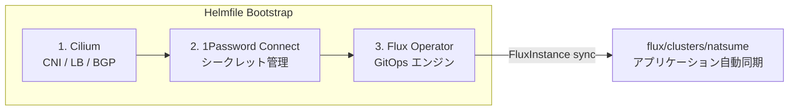
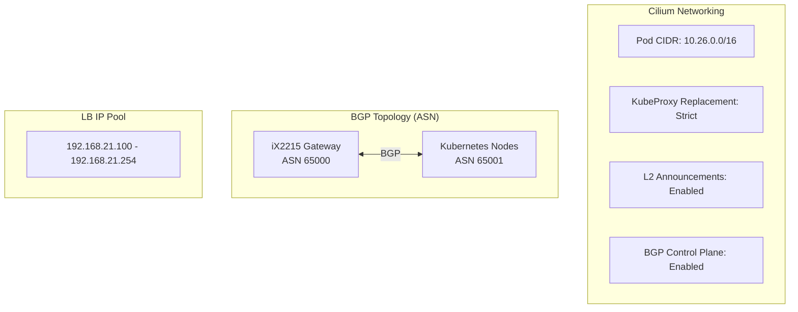

# PKE Helmfile Configuration

Kubernetes クラスターの**ブートストラップ（初期構築）**を行うための Helmfile 設定です。

## 概要


```mermaid
flowchart LR
    subgraph "Helmfile Bootstrap"
        direction LR
        C["1. Cilium<br/>CNI / LB / BGP"] --> OP["2. 1Password Connect<br/>シークレット管理"]
        OP --> F["3. Flux Operator<br/>GitOps エンジン"]
    end

    F -->|"FluxInstance sync"| APPS["flux/clusters/natsume<br/>アプリケーション自動同期"]
```

Helmfile の役割は以下のブートストラップコンポーネントのデプロイに限定されています。その他のアプリケーション・プラットフォームコンポーネントは Flux が `flux/clusters/natsume` ディレクトリから自動管理します。

### 管理対象コンポーネント

| 順序 | コンポーネント | Chart Version | 用途 |
|------|---------------|---------------|------|
| 1 | Cilium | 1.19.3 | CNI / NetworkPolicy / LoadBalancer (L2 + BGP) |
| 2 | 1Password Connect | 2.4.1 | シークレット管理基盤 |
| 3 | Flux Operator | 0.48.0 | Flux CD 管理 |

## ディレクトリ構造

```
helmfile/
├── helmfile.yaml                    # メインHelmfile設定
├── 1password-credentials.json       # 1Password Connect認証情報（要手動配置）
│
├── values/
│   ├── cilium.gotmpl               # Cilium CNI設定
│   └── 1password-connect.gotmpl    # 1Password Connect設定
│
└── manifests/
    └── flux/
        └── fluxinstance.yaml       # Flux controller と Git sync 設定
```

## Cilium 設定詳細


```mermaid
graph TB
    subgraph "Cilium Networking"
        CIDR["Pod CIDR: 10.26.0.0/16"]
        KP["KubeProxy Replacement: Strict"]
        L2["L2 Announcements: Enabled"]
        BGP["BGP Control Plane: Enabled"]
    end

    subgraph "BGP Topology (ASN)"
        GW["iX2215 Gateway<br/>ASN 65000"]
        K8S["Kubernetes Nodes<br/>ASN 65001"]
    end

    GW <-->|BGP| K8S

    subgraph "LB IP Pool"
        POOL["192.168.21.100 - 192.168.21.254"]
    end
```

- **IP Allocation**: cluster-pool（10.26.0.0/16）
- **Routing**: Native routing
- **KubeProxy**: Strict replacement（K8s API: 192.168.20.10:6443）
- **LB IP Pool**: 192.168.21.100 - 192.168.21.254
- **BGP**: Cilium BGP Control Plane で LoadBalancer IP を広報
- **Hubble**: UI 有効（hubble.str08.net）、メトリクス収集（DNS/Drop/TCP/Flow/HTTP）

## 前提条件

- Kubernetes クラスターが Ansible で構築済みであること
- Helmfile (v0.165.0+)
- Helm (v3.10+)
- kubectl（クラスターへの接続設定済み）
- 1Password CLI（`op` コマンド）

## デプロイ手順

### 1. 1Password Connect 準備

`1password-credentials.json` を `helmfile/` ディレクトリに配置します。

### 2. 環境変数設定

```bash
export ONEPASSWORD_TOKEN="<your-token>"
```

### 3. デプロイ実行

```bash
# 依存関係順に個別実行
helmfile -l name=cilium apply    # 1. CNI
helmfile -l name=connect apply   # 2. シークレット基盤
helmfile -l name=flux-operator apply # 3. GitOps基盤

# または一括実行（依存関係は needs で定義済み）
helmfile apply
```

## Flux デプロイ後

Flux Operator デプロイ後に `manifests/flux/fluxinstance.yaml` が適用され、Flux controller と `flux/clusters/natsume` の Git 同期が開始します。

### ブートストラップの再実行

Cilium や Flux Operator 自体のアップグレードが必要な場合は、再度 Helmfile を実行してください。

```bash
helmfile apply
```
