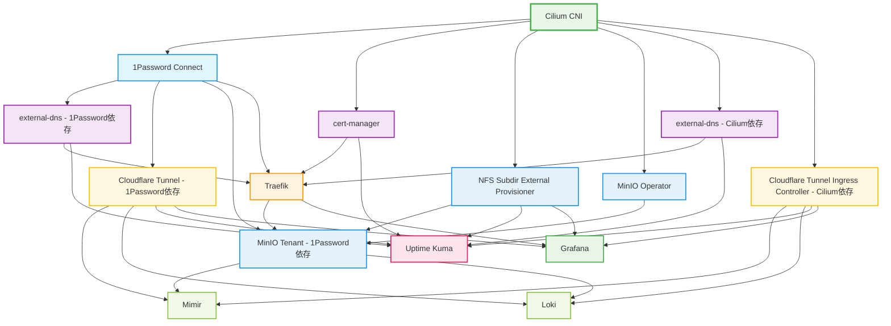

# PKE Helmfile Configuration

このディレクトリは、高可用性Kubernetesクラスター上にアプリケーションスタックをデプロイするためのHelmfile設定を含んでいます。

## 概要

PKE Helmfileは、Kubernetes上に完全なアプリケーションプラットフォームを構築するために、以下の13のコンポーネントを管理・デプロイします：

### 基盤ネットワーク・CNIレイヤー（デプロイ順序：1）
- **Cilium** (v1.18.0): CNI（Container Network Interface）、NetworkPolicy、LoadBalancer、Service Mesh機能

### コア基盤サービス（デプロイ順序：2）
- **1Password Connect** (v2.0.2): 中央集権的シークレット管理とKubernetes統合
- **cert-manager** (v1.18.2): Let's Encrypt等による自動TLS証明書管理
- **NFS Subdir External Provisioner** (v4.0.18): NFS動的ボリュームプロビジョニング
- **MinIO Operator** (v7.1.1): S3互換オブジェクトストレージ基盤

### DNS・外部接続サービス（デプロイ順序：3）
- **external-dns** (v1.17.0): Cloudflare等のDNSプロバイダーとの自動レコード同期
- **Cloudflare Tunnel Ingress Controller** (v0.0.18): セキュアな外部アクセストンネル（Zero Trust）

### Ingress・ロードバランシング（デプロイ順序：4）
- **Traefik** (v37.0.0): パブリックHTTP/HTTPSロードバランサー・リバースプロキシ

### ストレージ・データ管理（デプロイ順序：5）
- **MinIO Tenant** (v7.1.1): マルチテナント対応オブジェクトストレージインスタンス（高可用性構成）

### アプリケーション・監視サービス（デプロイ順序：5-7）
- **Uptime Kuma** (v2.22.0): Webサービス・API監視・通知・ダウンタイム管理
- **Grafana** (v9.3.1): 統合可視化ダッシュボード・アラート管理・メトリクス分析

### 高度監視・オブザーバビリティスタック（デプロイ順序：7）
- **Mimir Distributed** (v5.7.0): 高性能メトリクス収集・保存・クエリエンジン（Prometheus互換、長期保存）
- **Loki** (v6.35.1): ログ集約・検索・分析システム（Grafana統合）

## ディレクトリ構造

```
helmfile/
├── helmfile.yaml                    # メインHelmfile設定（リリース定義・依存関係）
├── 1password-credentials.json       # 1Password Connect認証情報（秘匿情報）
├── README.md                       # 本ドキュメント
│
├── values/                         # Helm Values設定（Go Template）
│   ├── 1password-connect.gotmpl    # 1Password Connect設定
│   ├── cilium.gotmpl              # Cilium CNI設定
│   ├── cloudflare-tunnel-ingress-controller.gotmpl  # Cloudflare Tunnel設定
│   ├── external-dns.gotmpl         # External DNS設定
│   ├── grafana.gotmpl             # Grafana設定
│   ├── loki.gotmpl                # Loki設定
│   ├── mimir.gotmpl               # Mimir設定
│   ├── minio-tenant.gotmpl         # MinIO Tenant設定
│   ├── nfs-subdir-external-provisioner.gotmpl  # NFS Provisioner設定
│   ├── traefik.gotmpl             # Traefik設定
│   └── uptime-kuma.gotmpl          # Uptime Kuma設定
│
└── manifests/                      # 追加Kubernetesマニフェスト
    ├── cert-manager/
    │   └── clusterissuer.yaml      # Let's Encrypt ClusterIssuer
    ├── cilium/
    │   └── default-pool.yaml       # Cilium LoadBalancer Pool
    ├── cloudflare-tunnel-ingress-controller/
    │   └── onepassworditem.yaml    # Cloudflare API Token Secret
    ├── external-dns/
    │   └── onepassworditem.yaml    # DNS Provider Secret
    ├── loki/
    │   └── onepassworditem.yaml    # Loki認証情報
    ├── mimir/
    │   └── onepassworditem.yaml    # Mimir認証情報
    ├── minio-tenant/
    │   └── onepassworditem.yaml    # MinIO認証情報
    └── traefik/
        └── certificate.yaml        # パブリックドメイン証明書
```

## アーキテクチャと依存関係

### デプロイメント順序とサービス依存



### 詳細依存関係マトリクス

| コンポーネント | 直接依存 | 間接依存 | デプロイ順序 |
|---------------|----------|----------|------------|
| **Cilium** | なし | なし | 1 |
| **1Password Connect** | Cilium | なし | 2 |
| **cert-manager** | Cilium | なし | 2 |
| **NFS Subdir External Provisioner** | Cilium | なし | 2 |
| **MinIO Operator** | Cilium | なし | 2 |
| **external-dns** | Cilium, 1Password Connect | なし | 3 |
| **Cloudflare Tunnel Ingress Controller** | Cilium, 1Password Connect | なし | 3 |
| **Traefik** | 1Password Connect, cert-manager, external-dns | Cilium | 4 |
| **MinIO Tenant** | NFS Provisioner, 1Password Connect, Traefik, MinIO Operator | Cilium, cert-manager, external-dns | 5 |
| **Uptime Kuma** | NFS Provisioner, cert-manager, external-dns, Cloudflare Tunnel | Cilium, 1Password Connect | 5 |
| **Grafana** | NFS Provisioner, Traefik, Cloudflare Tunnel | すべての基盤コンポーネント | 6 |
| **Mimir** | MinIO Tenant, Cloudflare Tunnel | すべての基盤・ストレージコンポーネント | 7 |
| **Loki** | MinIO Tenant, Cloudflare Tunnel | すべての基盤・ストレージコンポーネント | 7 |

### 主要設定パラメータ

#### グローバル設定 (values/*.gotmpl)

**ネットワーク設定**:
```yaml
# 共通ドメイン設定
domain: "example.com"

# Load Balancer設定
loadbalancer_ip_range: "192.168.20.100-192.168.20.110"

# Certificate管理
cert_manager_email: "admin@example.com"
```

**ストレージ設定**:
```yaml
# NFS設定
nfs_server: "192.168.20.10"
nfs_path: "/mnt/nfs/kubernetes"

# MinIO設定
minio_tenant_size: "4Ti"
minio_pools: 4
```

## 前提条件

### 必要なツール・環境
- **Kubernetes Cluster**: 高可用性構成（Ansibleで構築）
- **Helmfile** (v0.165.0+): [インストールガイド](https://helmfile.readthedocs.io/en/latest/installation/)
- **Helm** (v3.10+): [インストールガイド](https://helm.sh/docs/intro/install/)
- **kubectl**: Kubernetesクラスターへの接続設定済み
- **1Password CLI**: [1Password CLI](https://developer.1password.com/docs/cli/)

### 前提インフラ要件
1. **ロードバランサー**: HAProxy + Keepalived（Ansibleで構築）
2. **DNS設定**: 外部DNSプロバイダー（Cloudflare推奨）アクセス
3. **TLS証明書**: Let's Encryptまたは自己証明書
4. **ストレージ**: NFSサーバーまたは他の永続ストレージ

## 環境設定・初期セットアップ

### 1. 1Password Connect サーバー設定

```bash
cd pke/helmfile

# 1Password Connectサーバーを作成（Kubernetes専用Vault付き）
op connect server create PKE-kkg --vaults kubernetes

# 認証トークンの生成と環境変数設定
export ONEPASSWORD_TOKEN=$(op connect token create kkg --server PKE-kkg --vault kubernetes)

# 認証情報ファイルの生成（必須）
op connect server get PKE-kkg --format json > 1password-credentials.json
```

### 2. Cloudflare 外部アクセス設定

Cloudflare Tunnelによる安全な外部アクセス設定：

```bash
# Cloudflare Dashboard操作
# 1. Cloudflare Zero Trust > Access > Tunnels
# 2. 新しいトンネル "pke-kkg" を作成
# 3. Connector Token を取得して1Password Vaultに保存

# 詳細設定: https://developers.cloudflare.com/cloudflare-one/connections/connect-networks/deployment-guides/kubernetes/
```

### 3. シークレット事前準備

1Password Vault "kubernetes" に以下のアイテムを作成：

| Item Name | Type | Fields | Usage |
|-----------|------|--------|-------|
| `cloudflare-tunnel` | API Credential | `token` | Cloudflare Tunnel認証 |
| `external-dns-cloudflare` | API Credential | `api-token` | DNS管理 |
| `minio-root-credentials` | Login | `username`, `password` | MinIOルート認証 |
| `mimir-credentials` | Login | `username`, `password` | Mimir認証 |
| `loki-credentials` | Login | `username`, `password` | Loki認証 |

### 4. DNS・ネットワーク設定

**外部DNSレコード設定例**:
```bash
# Cloudflare等で以下を設定
*.kkg.example.com    A    <LoadBalancer_VIP>
kkg.example.com      A    <LoadBalancer_VIP>
```

## デプロイメント手順

### 基本フロー

#### 1. 設定検証・プリフライトチェック

```bash
cd pke/helmfile

# Kubernetesクラスター接続確認
kubectl cluster-info
kubectl get nodes

# Helmfile設定検証
helmfile -f helmfile.yaml list
helmfile -f helmfile.yaml template | head -50

# 1Password Connect接続テスト
curl -H "Authorization: Bearer $ONEPASSWORD_TOKEN" \
     https://connect-api.1password.com/v1/health
```

#### 2. 段階的デプロイメント

**Phase 1: 基盤ネットワーク（第1層）**
```bash
# CNI・基盤ネットワーク（最重要・最優先）
helmfile -l name=cilium apply
```

**Phase 2: コア基盤サービス（第2層）**
```bash
# シークレット管理基盤
helmfile -l name=connect apply

# 証明書管理
helmfile -l name=cert-manager apply

# ストレージプロビジョニング
helmfile -l name=nfs-subdir-external-provisioner apply

# オブジェクトストレージ基盤
helmfile -l name=minio-operator apply
```

**Phase 3: DNS・外部接続サービス（第3層）**
```bash
# DNS管理
helmfile -l name=external-dns apply

# 外部アクセストンネル
helmfile -l name=cloudflare-tunnel-ingress-controller apply
```

**Phase 4: Ingress・ロードバランサー（第4層）**
```bash
# HTTP/HTTPSロードバランサー
helmfile -l name=traefik apply
```

**Phase 5: ストレージ・初期アプリケーション（第5層）**
```bash
# オブジェクトストレージテナント
helmfile -l name=minio-tenant apply

# 監視アプリケーション
helmfile -l name=uptime-kuma apply

# ダッシュボード
helmfile -l name=grafana apply
```

**Phase 6: 高度監視スタック（第6-7層）**
```bash
# メトリクス長期保存・分析
helmfile -l name=mimir apply

# ログ集約・分析
helmfile -l name=loki apply
```

#### 3. 完全自動デプロイ

```bash
# 全コンポーネント一括デプロイ（依存関係順）
helmfile apply

# 並列実行（高速化）
helmfile apply --concurrency 5
```

### 操作コマンド詳細

#### 状態確認・管理

```bash
# 全リリース状態確認
helmfile status

# 特定リリースの詳細確認
helmfile -l name=grafana status
helm -n grafana status grafana

# 設定差分確認
helmfile diff
helmfile -l name=traefik diff

# リリース履歴
helm -n grafana history grafana
```

#### 更新・ロールバック

```bash
# 設定変更の適用
helmfile apply

# 特定コンポーネントの強制再デプロイ
helmfile -l name=grafana sync

# ロールバック
helm -n grafana rollback grafana 1  # リビジョン1にロールバック
```

#### クリーンアップ

```bash
# 全リリース削除
helmfile destroy

# 特定リリースのみ削除
helmfile -l name=uptime-kuma destroy

# ネームスペース確認・手動削除
kubectl get namespaces
kubectl delete namespace <namespace> --force --grace-period=0

# 重要サービスの稼働確認
kubectl -n kube-system get pods -l k8s-app=cilium
kubectl -n cert-manager get pods
kubectl -n 1password get pods
kubectl -n traefik get pods
kubectl -n mimir get pods
kubectl -n loki get pods
```

#### ネットワーク・接続性診断

```bash
# CNI（Cilium）状態確認
kubectl -n kube-system exec ds/cilium -- cilium status --brief

# LoadBalancer・Ingress確認
kubectl get svc -A --field-selector spec.type=LoadBalancer
kubectl get ingress -A

# DNS解決テスト
kubectl run -it --rm debug --image=busybox --restart=Never -- nslookup kubernetes.default
```

#### 証明書・TLS確認

```bash
# cert-manager証明書状態
kubectl get certificates -A
kubectl get certificaterequests -A
kubectl get clusterissuers

# 証明書詳細確認
kubectl describe certificate <cert-name> -n <namespace>
```

### よくある問題・解決方法

#### 1. 1Password Connect関連

**症状**: OnePasswordItem CRDでシークレット取得エラー
```bash
# Connect Server接続確認
kubectl -n 1password logs deployment/connect-api

# 認証トークン確認
kubectl -n 1password describe secret onepassword-token

# OnePasswordItem状態確認
kubectl get onepassworditems -A
kubectl describe onepassworditem <item-name> -n <namespace>
```

**解決方法**:
- 1Password Connect Server接続確認
- Vault権限確認
- 認証トークン更新

**解決方法**:
- `ONEPASSWORD_TOKEN`環境変数の再設定
- `1password-credentials.json`の再生成
- Connectサーバーの再起動

#### 2. 証明書・DNS関連

**症状**: Let's Encrypt証明書発行失敗
```bash
# cert-manager詳細ログ
kubectl -n cert-manager logs deployment/cert-manager -f

# ACME Challenge確認
kubectl get challenges -A
kubectl describe challenge <challenge-name> -n <namespace>

# DNS確認
dig TXT _acme-challenge.example.com @8.8.8.8
```

**解決方法**:
- External-DNS認証情報確認
- Rate Limit確認（Let's Encrypt）

#### 3. Ingress・ロードバランサー

**症状**: TraefikでService到達不可
```bash
# Traefik設定確認
kubectl -n traefik logs deployment/traefik -f

# Service・Endpoint確認
kubectl get svc,ep -n <target-namespace>

# IngressRoute確認（Traefik CRD）
kubectl get ingressroute -A
kubectl describe ingressroute <name> -n <namespace>
```

**解決方法**:
- Service selector・ラベル確認
- NetworkPolicy確認
- Traefik middleware設定確認

#### 4. ストレージ関連

**症状**: PVC作成・マウントエラー
```bash
# StorageClass確認
kubectl get storageclass

# PV・PVC状態
kubectl get pv,pvc -A

# NFS Provisioner確認
kubectl -n kube-system logs deployment/nfs-subdir-external-provisioner
```

**解決方法**:
- NFSサーバー接続確認
- アクセス権限確認
- StorageClass annotation確認

### 監視・アラート設定

#### Mimir + Loki + Grafana

**重要メトリクス監視**:
```bash
# Mimir接続確認
kubectl port-forward -n mimir svc/mimir-query-frontend 8080:8080
curl http://localhost:8080/prometheus/api/v1/query?query=up

# Loki接続確認
kubectl port-forward -n loki svc/loki-query-frontend 3100:3100
curl http://localhost:3100/ready

# Grafana初期設定
kubectl -n grafana get secret grafana -o jsonpath="{.data.admin-password}" | base64 -d
```

**監視対象**:
- Kubernetes クラスター状態
- アプリケーション可用性
- リソース使用率（CPU/メモリ/ストレージ）
- ネットワーク品質

### 運用ベストプラクティス

#### 定期メンテナンス

**週次チェックリスト**:
```bash
# 1. システム全体ヘルスチェック
helmfile status

# 2. 証明書有効期限確認
kubectl get certificates -A -o custom-columns=NAME:.metadata.name,NAMESPACE:.metadata.namespace,READY:.status.conditions[0].status,EXPIRY:.status.notAfter

# 3. ディスク使用量確認
kubectl top nodes
kubectl top pods -A --sort-by=memory

# 4. バックアップ確認（推奨：etcd、persistent volume）
```

**月次アップデート**:
```bash
# Helm Chart更新確認
helmfile diff

# セキュリティアップデート
# - Kubernetes版数確認
# - コンテナイメージ脆弱性スキャン
```

#### セキュリティ考慮事項

1. **シークレット管理**:
   - 1Password Vault定期監査
   - 不要なシークレット削除
   - アクセス権限最小化

2. **ネットワークセキュリティ**:
   - NetworkPolicy適用
   - 不要ポート閉鎖
   - シークレット管理の改善

3. **証明書管理**:
   - 証明書ローテーション確認
   - 期限切れアラート設定

### スケーリング・カスタマイズ

#### 新しい環境への適用

1. **values設定のカスタマイズ**:
```bash
# values/を新環境用にコピー
cp -r values/ values-production/

# 環境固有設定の更新
# - ドメイン名
# - IPアドレス範囲  
# - リソースサイズ
```

2. **環境別helmfile.yaml**:
```yaml
# helmfile-production.yaml
environments:
  production:
    values:
      - values-production/{{`{{ .Release.Name }}`}}.gotmpl
```

#### パフォーマンス調整

**高負荷環境向け設定例**:
```yaml
# values/mimir.gotmpl
mimir:
  query_frontend:
    replicas: 3
    resources:
      requests: { cpu: 500m, memory: 1Gi }
  store_gateway:
    replicas: 3
    resources:
      requests: { cpu: 1, memory: 2Gi }
```

## 注意事項・制限事項

### セキュリティ要件
- **機密ファイル**: `1password-credentials.json`はリポジトリ除外（`.gitignore`設定済み）
- **環境変数**: `ONEPASSWORD_TOKEN`は永続化禁止
- **アクセス制御**: kubectl権限最小化、RBAC適用

### 運用制限
- **順次デプロイ**: 依存関係のため一部コンポーネントは順次実行必須
- **外部依存**: CloudflareDNS、1Password Connect Server等の外部サービス依存
- **リソース要件**: 最小構成でも16GB RAM、8 CPU推奨（監視スタック含む）

### アップグレード注意点
- **CRD変更**: cert-manager、Cilium等のCRD互換性確認必須
- **データ移行**: Victoria Metrics、MinIO等のデータ移行計画
- **ダウンタイム**: 一部コンポーネントは短時間のダウンタイム発生可能性
- **データバックアップ**: MinIO、Grafana設定等の事前バックアップ推奨
- **バージョン互換性**: Helm Chart、Kubernetesバージョンの互換性確認必須

---

## 関連リンク

### 公式ドキュメント
- [Helmfile](https://helmfile.readthedocs.io/)
- [Cilium](https://docs.cilium.io/)
- [Traefik](https://doc.traefik.io/traefik/)
- [cert-manager](https://cert-manager.io/)
- [Grafana Mimir](https://grafana.com/docs/mimir/)
- [Grafana Loki](https://grafana.com/docs/loki/)

### PKE関連ドキュメント
- [Terraform Infrastructure](../terraform/README.md)
- [Ansible Configuration](../ansible/README.md)
- [Application Manifests](../manifest/README.md)