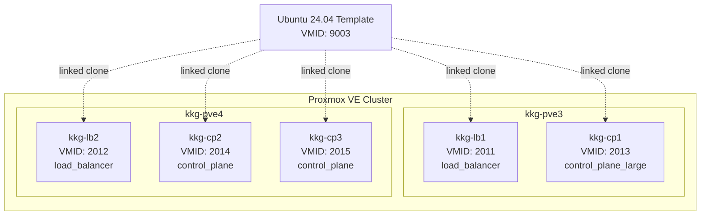

# KKG Cluster Terraform Configuration

Proxmox VE 上に Kubernetes（KKG）クラスター用の VM を管理する Terraform 設定です。

## 概要



### 管理対象 VM

| VM名 | VMID | タイプ | メモリ | CPU | ディスク | IPアドレス | ホスト |
|------|------|--------|--------|-----|----------|-----------|--------|
| kkg-lb1 | 2011 | load_balancer | 2GB | 8コア | 20GB | 192.168.20.11 | kkg-pve3 |
| kkg-lb2 | 2012 | load_balancer | 2GB | 8コア | 20GB | 192.168.20.12 | kkg-pve4 |
| kkg-cp1 | 2013 | control_plane_large | 32GB | 8コア | 100GB | 192.168.20.13 | kkg-pve3 |
| kkg-cp2 | 2014 | control_plane | 16GB | 8コア | 100GB | 192.168.20.14 | kkg-pve4 |
| kkg-cp3 | 2015 | control_plane | 16GB | 8コア | 100GB | 192.168.20.15 | kkg-pve4 |

## ファイル構成

```
terraform/kkg/
├── main.tf                 # Terraform設定（Provider, Backend, Resource）
├── variables.tf            # 変数定義
├── cluster-config.yaml     # クラスター設定（VM仕様、ネットワーク）
├── setup.sh                # 環境変数セットアップ（1Password連携）
├── template.sh             # Ubuntu 24.04 テンプレート作成
└── README.md
```

## 技術仕様

### Provider / Backend

- **Terraform**: >= 1.3
- **Proxmox Provider**: telmate/proxmox 3.0.2-rc07
- **State Backend**: Cloudflare R2（S3 互換）
  - Bucket: `tfstate`
  - Key: `pke/kkg/terraform.tfstate`

### VM テンプレート

- **OS**: Ubuntu 24.04 minimal (cloud image)
- **Template VMID**: 9003
- **クローン方式**: Linked clone（ストレージ効率化）
- **CPU Type**: host
- **SCSI Controller**: virtio-scsi-pci
- **Disk Format**: raw + SSD emulation

### VM タイプ定義

| タイプ | メモリ | CPU | ディスク |
|--------|--------|-----|----------|
| control_plane | 16GB | 8コア×1ソケット | 100GB |
| control_plane_large | 32GB | 8コア×1ソケット | 100GB |
| load_balancer | 2GB | 8コア×1ソケット | 20GB |

### ネットワーク

- **サブネット**: 192.168.20.0/23
- **ゲートウェイ / DNS**: 192.168.20.1
- **ブリッジ**: vmbr0
- **NIC モデル**: virtio

## 前提条件

- Terraform >= 1.3
- Proxmox VE サーバーへの API アクセス
- SSH 公開鍵
- Cloudflare R2 認証情報（State Backend 用）

## 使用方法

### 環境変数の設定

```bash
# 1Password CLI 連携（推奨）
source setup.sh

# または手動設定
export TF_VAR_proxmox_api_url="https://your-proxmox-server:8006/api2/json"
export TF_VAR_proxmox_api_id="your-token-id"
export TF_VAR_proxmox_api_secret="your-token-secret"
export TF_VAR_ssh_public_key="$(cat ~/.ssh/id_ed25519.pub)"
export AWS_ACCESS_KEY_ID="your-r2-access-key"
export AWS_SECRET_ACCESS_KEY="your-r2-secret-key"
```

### テンプレート作成（初回のみ）

```bash
./template.sh
```

Ubuntu 24.04 minimal cloud image をダウンロードし、VMID 9003 のテンプレートを作成します。

### VM 管理

```bash
terraform init              # 初期化
terraform plan              # 変更確認
terraform apply             # 適用

# 特定のVMのみ操作
terraform apply -target="proxmox_vm_qemu.vms[\"kkg-cp1\"]"
```

### VM スペック変更

`cluster-config.yaml` を編集して `terraform apply` を実行します。

- **VM タイプ変更**: `vm_types` セクション
- **個別 VM 設定**: `vms` セクション
- **ネットワーク設定**: `cluster.network` セクション

## トラブルシューティング

```bash
# デバッグログ
export TF_LOG=DEBUG
terraform apply

# 状態確認
terraform show
```

- **VM 作成失敗**: Proxmox API 認証情報、テンプレートの存在、ストレージ容量を確認
- **ネットワーク接続不可**: IP アドレス競合、ブリッジ設定、cloud-init の動作を確認
