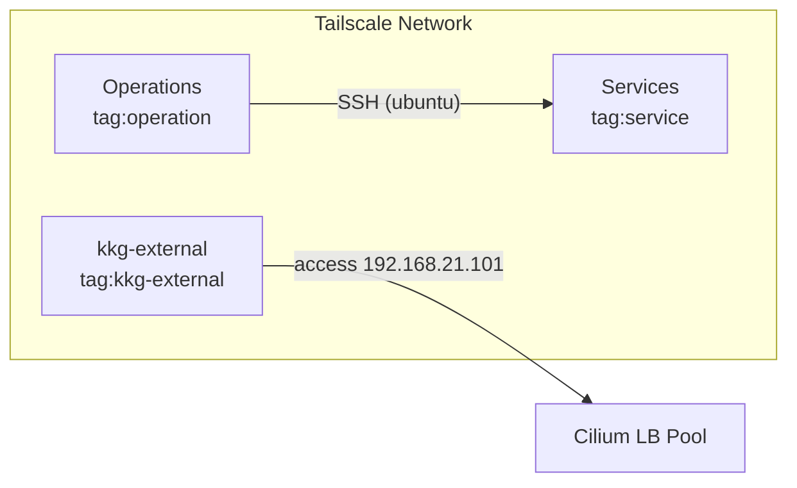

# Tailscale ACL Terraform Configuration

Tailscale の ACL（Access Control List）を Terraform で管理する設定です。

## 概要



- **Provider**: tailscale/tailscale 0.27.0
- **State Backend**: Cloudflare R2（S3 互換）
  - Bucket: `tfstate`
  - Key: `pke/tailscale/terraform.tfstate`

## ACL 設定

### タグ・グループ

| タグ | Owner | 用途 |
|------|-------|------|
| `tag:kkg-external` | group:kkg | 外部からのクラスターアクセス |
| `tag:service` | group:service | サービスノード |
| `tag:operation` | group:operation | 運用ノード |

### アクセス制御

- **デフォルト ACL**: 全トラフィック許可（`*:* → accept`）
- **Grants**: `tag:kkg-external` → `192.168.21.101/32`（全ポート）
- **SSH**: `tag:operation` → `tag:service`（ubuntu ユーザー、check モード）

## ファイル構成

```
terraform/tailscale/
├── main.tf             # ACL定義（Provider, Backend, Resource）
├── setup.sh            # 環境変数セットアップ（1Password連携）
├── import_acl.sh       # 既存ACLインポートスクリプト
└── README.md
```

## 前提条件

- Terraform CLI
- Tailscale API キー
- Cloudflare R2 認証情報（State Backend 用）

## 使用方法

### 環境変数の設定

```bash
# 1Password CLI 連携（推奨）
source setup.sh

# または手動設定
export TAILSCALE_API_KEY="your-api-key"
export AWS_ACCESS_KEY_ID="your-r2-access-key"
export AWS_SECRET_ACCESS_KEY="your-r2-secret-key"
```

### 新規セットアップ

```bash
terraform init
terraform plan
terraform apply
```

### 既存 ACL のインポート

```bash
# 自動（前提条件チェック + API接続確認 + import）
./import_acl.sh

# 手動
terraform init
terraform import tailscale_acl.main acl
terraform plan
```

## 注意事項

- ACL の変更は慎重に行ってください。誤った設定は通信遮断を招く可能性があります
- API キーおよび R2 認証情報は機密情報です。適切に管理してください
